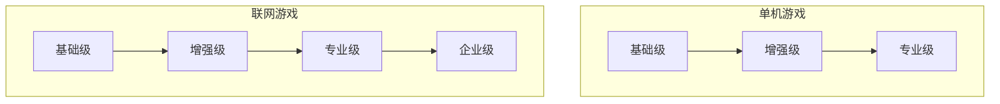

# 反作弊防御体系

本文档介绍 gg 引擎的分级分层反作弊防御体系。

## 防御哲学

| 原则 | 说明 |
| :--- | :--- |
| 服务器是唯一的真相源 | 联网游戏的安全边界在服务端 |
| 提高成本而非追求绝对 | 让攻击者投入的时间 > 游戏商业价值窗口期 |
| 玩家体验零影响 | 防御不得造成可感知的性能下降 |
| 模糊响应 | 检测到异常时延迟惩罚、静默记录 |
| 分层可配 | 独立开发者只需基础模块；大厂可扩展机器学习 |

## 防御等级



| 等级 | 适用对象 | 核心目标 |
| :--- | :--- | :--- |
| 基础级 | 独立开发者 / 小型团队 | 阻挡小白级修改器与盗版传播 |
| 增强级 | 中型团队 / 有经济系统的单机 | 增加逆向成本，延迟破解窗口 |
| 专业级 | 大型单机 / 中度联网游戏 | 服务器权威校验 + 行为分析 |
| 企业级 | 头部网游 / 电竞级项目 | 机器学习反作弊 + 法律溯源 |

## 内置防御能力

### 单机游戏

| 能力名称 | 启用方式 | 功能描述 |
| :--- | :--- | :--- |
| `integrity_check` | `anti_cheat: basic` | 对 `@sensitive` 函数进行 CRC 校验 |
| `memory_obfuscate` | `memory_protect: basic` | 对 `@encrypted` 字段自动异或加密 |
| `archive_bind` | `save_protect: basic` | 存档 AES-GCM 加密并绑定硬件指纹 |
| `honeypot_field` | `@honeypot` 装饰器 | 生成蜜罐变量，被修改时触发软惩罚 |

### 联网游戏

| 能力名称 | 启用方式 | 功能描述 |
| :--- | :--- | :--- |
| `server_authority` | `@server_only` / `@server_validate` | 强制逻辑在服务器执行 |
| `network_encrypt` | `network: encrypt` | 协议 AES-128-CTR 加密 |
| `rate_limit` | `@rate_limit` 装饰器 | 限制函数调用频率 |
| `state_validation` | 服务器默认开启 | 对玩家移动进行合理性校验 |

## 使用方法

### 基础级防御

**配置文件**：

```json
{
    "anti_cheat": "basic",
    "memory_protect": "basic",
    "save_protect": "basic"
}
```

**组件标记**：

```tsx
[Encrypted] component PlayerData {
    gold: int;
    level: int;
}

[Sensitive(check_freq = "once_per_session")]
export function calculate_damage(att: int, def: int): int {
    // 关键逻辑
}
```

### 增强级防御

**蜜罐变量**：

```tsx
[Encrypted] component PlayerStatus {
    health: int;
    
    [Honeypot(trigger = "on_cheat_suspected")]
    _health_fake: int;
}
```

**自定义检测**：

```tsx
[CustomCheck(interval = 5.0)]
function advanced_sanity_check() {
    if (player.position.y < -1000 && player.is_alive) {
        report_event("underground_player", { pos: player.position });
        player.respawn();
    }
}
```

### 专业级与企业级

**字节码混淆**：

```bash
ggc compile --obfuscate-isa --obfuscate-cfg --obfuscate-str
```

**机器学习接口**：

```csharp
public class MyMLPredictor : MLPredictor
{
    public override float PredictCheatProbability(PlayerActionSequence seq)
    {
        return model.Run(seq.ToFeatureVector());
    }
}
```

## 响应策略

```json
{
    "anti_cheat_response": {
        "on_honeypot_trigger": "soft_penalty",
        "on_speed_hack": "correct_value",
        "on_server_validation_fail": "kick",
        "on_repeat_offense": "shadow_ban",
        "report_threshold": 3
    }
}
```

### 响应类型

| 类型 | 描述 |
| :--- | :--- |
| `soft_penalty` | 软惩罚：降低掉率等 |
| `correct_value` | 强制修正值 |
| `kick` | 踢下线 |
| `shadow_ban` | 移入神仙服 |
| `ban` | 永久封禁 |

## 蜜罐陷阱

蜜罐陷阱是 gg 引擎反作弊体系的重要组成部分，通过设置诱饵变量或实体来检测作弊行为。

### 内存蜜罐

创建一个玩家永远看不到的假实体，检测是否被修改：

```tsx
// 创建一个玩家永远看不到的假实体
var honeypot_entity = world.spawn_entity();
honeypot_entity.add(Health { current: 9999 });
honeypot_entity.add(TagHoneypot);

// 系统检测
system HoneypotMonitor {
    query = Query.all(TagHoneypot, Health);
    
    on_update() {
        foreach (var entity in query) {
            if (entity.health.current != 9999) {
                // 惩罚：降低暴击率
                player.crit_chance *= 0.8;
            }
        }
    }
}
```

### 组件字段蜜罐

在组件中添加蜜罐字段，使用诱惑性命名：

```tsx
[Encrypted] component PlayerStatus {
    health: int;
    
    [Honeypot(trigger = "on_cheat_suspected")]
    _god_mode: bool = false;  // 诱惑性命名
    
    [Honeypot(trigger = "on_cheat_suspected")]
    _unlimited_ammo: bool = false;  // 诱惑性命名
}
```

### 网络协议蜜罐

服务器生成不可达的宝箱实体，检测玩家是否尝试交互：

```tsx
// 服务器生成不可达宝箱
[ServerOnly]
function spawn_trap_chest() {
    var chest = world.spawn_entity();
    chest.add(Position { x: 0, y: -9999, z: 0 });  // 不可达位置
    chest.add(Chest { trap: true });
}

// 服务器交互处理
[ServerOnly]
function on_interact(player: Entity, target: Entity) {
    if (target.has_component(Chest) && target.get_component(Chest).trap) {
        player.mark_as_cheater("interacted_with_honeypot_chest");
        player.kick("检测到异常行为");
    }
}
```

### 蜜罐命名建议

将蜜罐字段命名为具有诱惑性的名称，吸引作弊者尝试修改：

| 推荐命名 | 说明 |
| :--- | :--- |
| `god_mode` | 无敌模式 |
| `unlimited_ammo` | 无限弹药 |
| `infinite_gold` | 无限金币 |
| `super_damage` | 超级伤害 |
| `no_clip` | 穿墙模式 |

### 蜜罐触发响应

蜜罐被触发时，执行软惩罚而非立即封禁：

```json
{
    "anti_cheat_response": {
        "on_honeypot_trigger": "soft_penalty",
        "soft_penalty_effects": {
            "reduce_drop_rate": 0.5,
            "reduce_crit_chance": 0.8,
            "increase_enemy_damage": 1.2
        }
    }
}
```

## 最佳实践

### 推荐做法

- 早期设计服务器权威架构
- 分层惩罚：首次记录，二次降低收益，三次限制匹配，四次封禁
- 延迟响应：检测到外挂后延迟 5~10 分钟执行惩罚
- 利用熵增：使用动态代码重排、指令集随机化
- 蜜罐命名诱惑：将蜜罐字段命名为 `god_mode`、`unlimited_ammo` 等

### 禁忌

- 不要依赖客户端校验结果
- 不要因防御导致崩溃
- 不要在发布版本弹出反作弊提示
- 不要使用单一强特征封禁
- 不要忽视性能

## 威胁防护速查

| 威胁 | 单机基础 | 单机增强 | 联网基础 | 联网专业 |
| :--- | :--- | :--- | :--- | :--- |
| Cheat Engine 修改数值 | ✅ 变量加密 | ✅ 蜜罐变量 | ✅ 服务器校验 | ✅ 行为分析 |
| 内存断点调试 | ✅ 反调试检测 | ✅ 代码 CRC | ✅ 反调试 | ✅ 动态重排 |
| 变速齿轮 | ❌ | ✅ 时间校验 | ✅ 服务器时间戳 | ✅ 移动速度校验 |
| 资产盗取 | ✅ 块乱序 | ✅ 文件头混淆 | N/A | ✅ 纹理水印 |
| 协议模拟 | N/A | N/A | ✅ 序列号+加密 | ✅ 状态机校验 |
| 脚本挂机 | N/A | N/A | ✅ 频率限制 | ✅ ML 序列检测 |

## 下一步

- 阅读 [网络架构](network.md) 了解服务器权威设计
- 阅读 [架构设计](architecture.md) 了解多阶段编程模型
