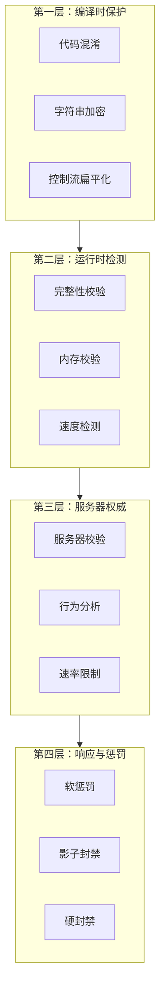

# 反作弊系统

Gnosis 安全系统位于 `Gnosis.Security` 包中，提供分层防御与安全加固基础设施。

---

## Gnosis.Security 子模块

| 子模块 | 职责 | 设计理由 |
|:---|:---|:---|
| `Obfuscation` | 代码混淆、字符串加密、控制流扁平化 | 增加逆向工程难度 |
| `Integrity` | 文件完整性校验、内存校验 | 防止篡改 |
| `AntiCheat` | 反作弊接口、行为分析钩子 | 多人游戏公平性的保障 |
| `Moderation` | UGC 内容审核接口、敏感词过滤抽象 | 用户生成内容的安全网关 |
| `Encryption` | 对称/非对称加密、哈希签名 | 数据传输与存储的保密性 |

---

## 分层防御架构



---

## 防御等级

| 等级 | 适用对象 | 核心目标 | 使用子模块 |
|------|----------|----------|-----------|
| **基础级** | 独立开发者 / 小型团队 | 阻挡修改器与盗版传播 | `Obfuscation` + `Integrity` |
| **增强级** | 中型团队 / 有经济系统的单机 | 增加逆向成本，延迟破解窗口 | + `Encryption` |
| **专业级** | 大型单机 / 中度联网游戏 | 服务器权威校验 + 行为分析 | + `AntiCheat` |
| **企业级** | 头部网游 / 电竞级项目 | 机器学习反作弊 + 法律溯源 | + `Moderation` + 外部服务 |

---

## 编译时保护

### 代码混淆

`Gnosis.Security.Obfuscation` 子模块在编译时对 gg 字节码进行混淆：

| 技术 | 描述 |
|------|------|
| 符号重命名 | 函数名、变量名替换为无意义字符串 |
| 控制流扁平化 | 将条件分支转换为 switch 分发 |
| 虚假控制流 | 插入不可达的分支代码 |
| 字符串加密 | 编译时加密字符串常量，运行时解密 |

### gg-script 中的加密标注

```tsx
[Encrypted]
component Wallet {
    gold: i32;
    gems: i32;
}

[Encrypted]
micro get_gold(): i32 {
    return wallet.gold;
}
```

`[Encrypted]` 是 GGScript 的特性标注，与 C# 的 `System.Attribute` 完全无关。编译器识别此标注后，自动为相关字段生成加密存取代码。

---

## 运行时检测

### 完整性校验

`Gnosis.Security.Integrity` 子模块提供：

| 校验类型 | 描述 |
|----------|------|
| 文件哈希 | 启动时校验关键文件完整性 |
| 内存校验 | 定期校验关键内存区域 |
| 代码段校验 | 检测代码段是否被修改 |
| 资源校验 | 校验加载的资产是否被替换 |

### 速度检测

| 检测方式 | 描述 |
|----------|------|
| 服务器时间比对 | 客户端时间与服务器时间差 |
| 帧间隔分析 | 检测异常的帧间隔 |
| 物理步进校验 | 校验物理模拟步长 |

---

## 服务器权威

### 核心原则

1. **服务器是唯一真相源**
2. **客户端仅发送输入，服务器计算状态**
3. **所有关键逻辑在服务器执行**

### 服务器校验

| 校验类型 | 描述 |
|----------|------|
| 移动校验 | 服务器验证移动合法性 |
| 伤害校验 | 服务器计算伤害 |
| 经济校验 | 服务器验证交易合法性 |
| 状态校验 | 服务器验证状态变更 |

### 行为分析

`Gnosis.Security.AntiCheat` 子模块提供行为分析钩子：

| 分析类型 | 描述 |
|----------|------|
| 统计异常 | 检测超出正常范围的数值 |
| 行为模式 | 检测非人类行为模式 |
| 时间分析 | 检测异常的操作时序 |
| 关联分析 | 检测多个指标间的异常关联 |

---

## 响应策略

### 软失败原则

检测到作弊时，**不立即惩罚**，而是：

1. **静默记录**：记录作弊证据，不暴露检测点
2. **延迟响应**：在随机时间后执行惩罚
3. **渐进升级**：从轻微惩罚逐步加重

### 响应类型

| 响应 | 描述 | 适用场景 |
|------|------|----------|
| 修正数值 | 静默将数值修正为合法值 | 速度作弊、数值修改 |
| 蜜罐触发 | 在假数据上触发检测 | 内存扫描 |
| 软惩罚 | 降低匹配优先级、减少收益 | 轻微违规 |
| 影子封禁 | 作弊者只能匹配其他作弊者 | 中度违规 |
| 踢出 | 断开连接 | 严重违规 |
| 硬封禁 | 账号封禁 | 极端违规 |

---

## UGC 内容审核

`Gnosis.Security.Moderation` 子模块提供 UGC 内容审核的抽象接口：

| 接口 | 描述 |
|------|------|
| `IContentModerator` | 内容审核接口 |
| `ITextFilter` | 敏感词过滤接口 |
| `IImageClassifier` | 图片分类接口 |

遵循 `Provider` 扩展点模式，具体审核后端由游戏引擎层或第三方服务实现。

---

## 加密

`Gnosis.Security.Encryption` 子模块提供：

| 功能 | 描述 |
|------|------|
| 对称加密 | AES-256-GCM |
| 非对称加密 | RSA-2048 / Ed25519 |
| 哈希签名 | SHA-256 / HMAC |
| 密钥派生 | PBKDF2 / Argon2 |

---

## 与其他包的协作

| 包 | 协作内容 |
|------|----------|
| `Gnosis.Network` | 传输加密、消息完整性校验 |
| `Gnosis.Runtime.Sandbox` | 脚本权限控制、资源配额 |
| `Gnosis.Database` | 数据加密存储 |
| `Gnosis.Asset` | 资产完整性校验 |
| `Gnosis.Plugin.Isolation` | 插件沙箱隔离 |
