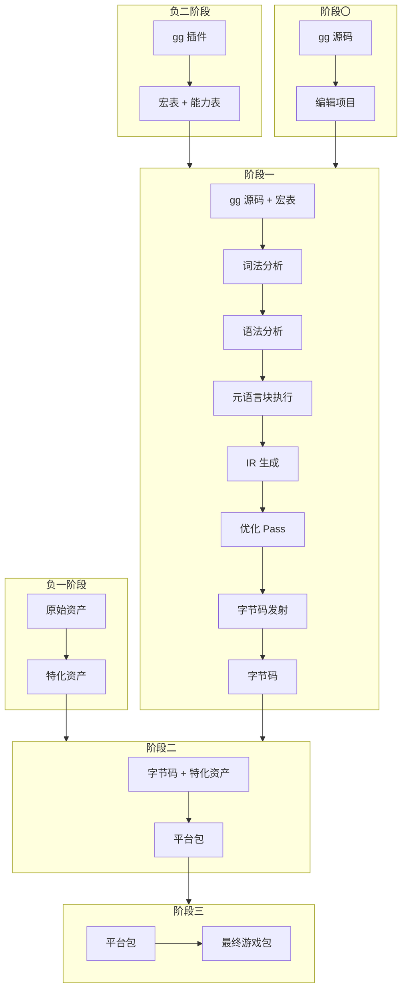
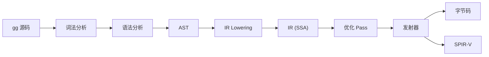
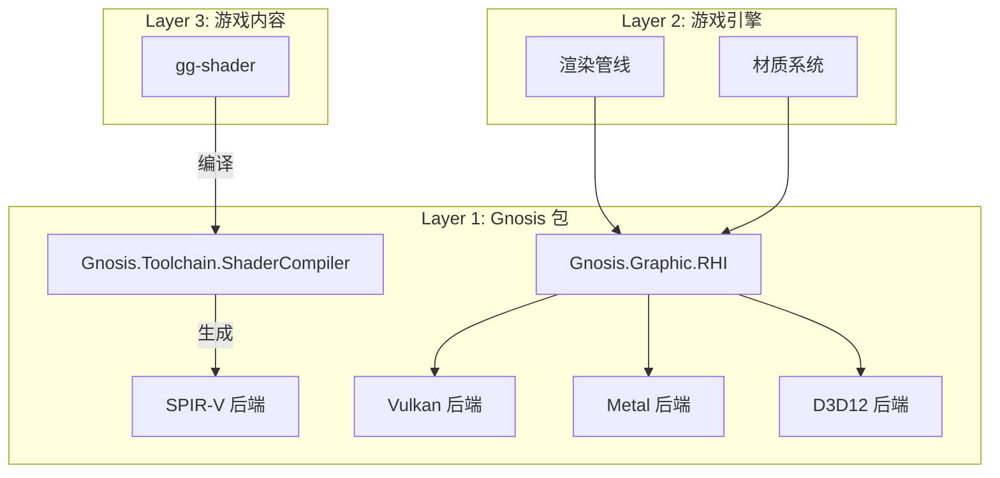

# 架构设计

本文档描述 Gnosis 引擎的整体架构设计。完整的 25 包结构与子模块说明请参阅 [架构详解](../maintenance/architecture.md)。

---

## 三层蛋糕模型

Gnosis 采用严格的三层架构，混淆这三层将导致设计决策的全面偏差。

```
┌─────────────────────────────────────────────────────────────────────────────┐
│                          Layer 3: 游戏内容层                                   │
│  ┌─────────┐ ┌─────────┐ ┌─────────┐ ┌─────────┐ ┌─────────┐ ┌─────────┐    │
│  │  Game   │ │  Mod    │ │  DLC    │ │ Plugin  │ │ Editor  │ │ Server  │    │
│  │ (gg)    │ │ (gg)    │ │ (gg)    │ │ (gg)    │ │ (gg)    │ │ (gg)    │    │
│  └─────────┘ └─────────┘ └─────────┘ └─────────┘ └─────────┘ └─────────┘    │
│                                                                              │
│  编写语言: gg-script / gg-shader / gg-widget / gg-neural                     │
│  责任方: 游戏开发者 / 模组作者 / 第三方工具开发者                               │
└─────────────────────────────────────────────────────────────────────────────┘
                                       ↑
                              (通过 Gnosis 框架层通信)
                                       ↑
┌─────────────────────────────────────────────────────────────────────────────┐
│                          Layer 2: 游戏引擎层 (官方范例)                         │
│                                                                              │
│  一个具体的、基于 Gnosis 元引擎构建的、可独立运行的 C# 应用程序。                  │
│  它包含: 编辑器界面、资产导入器、构建管线、项目模板、启动器。                       │
│                                                                              │
│  编写语言: C# (调用 Gnosis 包)                                                 │
│  责任方: Gnosis 官方团队 (提供范例实现)                                         │
└─────────────────────────────────────────────────────────────────────────────┘
                                       ↑
                              (通过直接 API 调用使用)
                                       ↑
┌─────────────────────────────────────────────────────────────────────────────┐
│                          Layer 1: Gnosis 元引擎层                              │
│                                                                              │
│  25 个 C# 包构成的基础设施。它本身不可运行，必须由游戏引擎层实例化。                │
│  它提供虚拟机、渲染 RHI、ECS、资产管线等能力。                                   │
│                                                                              │
│  编写语言: C# (零外部依赖)                                                      │
│  责任方: Gnosis 核心团队                                                       │
└─────────────────────────────────────────────────────────────────────────────┘
```

### 层间通信规则

| 通信方向 | 方式 | 约束 |
|----------|------|------|
| Layer 3 → Layer 2 | 通过 Gnosis 框架层 API | 游戏内容不能直接调用 C# 内部实现 |
| Layer 2 → Layer 1 | 直接 C# API 调用 | 游戏引擎可自由使用 Gnosis 包 |
| Layer 1 → Layer 1 | 包间依赖 | 必须遵循基础层 ← 核心层 ← 子系统层方向 |

---

## 多阶段编程模型

### 阶段划分

| 阶段 | 名称 | 执行者 | 输入 | 输出 |
|------|------|--------|------|------|
| **负二阶段** | 插件配置 | C# 元语言 | gg 插件 | 全局宏表、能力注册表 |
| **负一阶段** | 资产预处理 | C# 资产管线 | 原始资产 | 平台特化资产 |
| **阶段〇** | 开发编辑 | 编辑器 (gg) | gg 源码、资产 | 编辑后的项目 |
| **阶段一** | 元语言执行 | C# 编译器 | gg 源码 | 字节码 |
| **阶段二** | 打包构建 | 打包器 | 字节码 + 资产 | 平台包 |
| **阶段三** | 发布部署 | 部署器 | 平台包 | 最终游戏包 |

### 阶段间数据流



---

## 25 包概览

Gnosis 元引擎由 25 个 C# 包构成，按依赖层级分为三层：

### 基础层（零依赖）

| 包 | 职责 |
|:---|:---|
| `Gnosis.Core` | 数学、集合、事件、线程、IO、内存、哈希、时间、平台、配置、字符串、诊断 |
| `Gnosis.IR` | IR 图、指令集、分析、变换、Lowering、发射器、验证 |

### 核心层（依赖基础层）

| 包 | 职责 |
|:---|:---|
| `Gnosis.Runtime` | VM、Interop、协程、热重载、反射、调试、沙箱 |
| `Gnosis.ECS` | 实体、组件、原型、系统、查询、世界、命令、观察者 |
| `Gnosis.Asset` | VFS、格式、导入、处理、元数据、缓存、打包、引用 |
| `Gnosis.Scene` | 图、预制体、序列化、流式加载、层级、场景组件 |
| `Gnosis.Storage` | 存档、偏好、Provider、云端、迁移、快照 |
| `Gnosis.Database` | 存储引擎、WAL、事务、查询、索引、压缩、缓存 |

### 子系统层（依赖核心层）

| 包 | 职责 |
|:---|:---|
| `Gnosis.Graphic` | RHI、着色器、管线、材质、光照、阴影、后处理、计算、地形、植被、FX、角色、天空、剔除、捕获 |
| `Gnosis.Geometry` | 集群、剔除、流式加载、光栅化、压缩、构建器 |
| `Gnosis.Animation` | 片段、状态机、混合、补间、IK、适配器、重定向、事件、压缩 |
| `Gnosis.Neural` | 运行时、图、模型、绑定、推理、训练 |
| `Gnosis.Physics` | 形状、碰撞、动力学、查询、载具、破坏、布料、流体、角色 |
| `Gnosis.Audio` | 驱动、声源、听者、混音、片段、音库、合成 |
| `Gnosis.Input` | 设备、动作、绑定、手势、模拟、光标 |
| `Gnosis.Network` | 传输、信道、复制、RPC、大厅、序列化、预测、指标 |
| `Gnosis.Navigation` | 导航网格、查询、寻路、人群、连接、动态、分块 |
| `Gnosis.AI` | 行为树、状态机、感知、规划、效用、黑板、生成 |
| `Gnosis.Widget` | 元素、渲染、样式、布局、绑定、窗口、控件 |
| `Gnosis.GameUI` | 画布、元素、布局、渲染、字体、动画、输入 |
| `Gnosis.XR` | 会话、追踪、显示、输入、合成、锚点 |
| `Gnosis.Profiler` | 标记、采样、内存、网络、导出、实时 |
| `Gnosis.Security` | 混淆、完整性、反作弊、审核、加密 |
| `Gnosis.Toolchain` | 资产管线、烹饪、着色器编译、脚本编译、链接、部署 |
| `Gnosis.Plugin` | 宿主、加载器、隔离、依赖、扩展、清单、上下文 |

> 每个包的子模块详细说明请参阅 [架构详解](../maintenance/architecture.md)。

---

## 编译器架构

gg 编译器位于 `Gnosis.IR` 和 `Gnosis.Toolchain` 包中，负责将 gg 源码编译为字节码或 SPIR-V。

### 编译流水线



### 前端

| 前端 | 输入语言 | 对应包 |
|------|----------|--------|
| ScriptFrontend | gg-script | `Gnosis.Toolchain.ScriptCompiler` |
| ShaderFrontend | gg-shader | `Gnosis.Toolchain.ShaderCompiler` |

### IR 优化 Pass

| Pass | 描述 | 对应子模块 |
|------|------|-----------|
| 常量折叠 | 编译时计算常量表达式 | `Gnosis.IR.Transform` |
| 死代码消除 | 移除不可达代码 | `Gnosis.IR.Transform` |
| 内联 | 函数内联展开 | `Gnosis.IR.Transform` |
| 循环展开 | 编译时循环展开 | `Gnosis.IR.Transform` |
| 向量化 | 自动向量化 | `Gnosis.IR.Transform` |

### 发射器

| 发射器 | 目标格式 | 对应子模块 |
|--------|----------|-----------|
| 字节码发射器 | gg 字节码 | `Gnosis.IR.Emitter` |
| SPIR-V 发射器 | SPIR-V | `Gnosis.IR.Emitter` |
| 文本 IR 输出 | 可读 IR 文本 | `Gnosis.IR.Emitter` |

---

## 虚拟机架构

gg 虚拟机位于 `Gnosis.Runtime` 包中，负责解释执行 gg 字节码。

### VM 核心组件

| 组件 | 职责 | 对应子模块 |
|------|------|-----------|
| 字节码解释器 | 指令分发与执行 | `Gnosis.Runtime.VM` |
| 栈帧管理 | 调用栈与局部变量 | `Gnosis.Runtime.VM` |
| Interop | C# 原生函数绑定 | `Gnosis.Runtime.Interop` |
| 协程调度器 | 协程状态机 | `Gnosis.Runtime.Coroutine` |
| 热重载 | 代码热替换 | `Gnosis.Runtime.HotReload` |
| 调试接口 | 断点与单步 | `Gnosis.Runtime.Debug` |
| 沙箱 | 权限控制 | `Gnosis.Runtime.Sandbox` |

### 字节码执行模型

```
┌──────────────────────────────────────┐
│              VM 实例                   │
│  ┌────────────────────────────────┐  │
│  │         全局状态                 │  │
│  │  - 全局变量表                    │  │
│  │  - 类型注册表                    │  │
│  │  - 函数表                       │  │
│  └────────────────────────────────┘  │
│  ┌────────────────────────────────┐  │
│  │         调用栈                   │  │
│  │  ┌──────────────────────────┐  │  │
│  │  │ 栈帧 N                   │  │  │
│  │  │  - 返回地址               │  │  │
│  │  │  - 局部变量               │  │  │
│  │  │  - 操作数栈               │  │  │
│  │  ├──────────────────────────┤  │  │
│  │  │ 栈帧 N-1                 │  │  │
│  │  │  ...                     │  │  │
│  │  └──────────────────────────┘  │  │
│  └────────────────────────────────┘  │
│  ┌────────────────────────────────┐  │
│  │         堆                       │  │
│  │  - 对象实例                     │  │
│  │  - 字符串池                     │  │
│  │  - GC 管理区                    │  │
│  └────────────────────────────────┘  │
└──────────────────────────────────────┘
```

---

## ECS 架构

ECS 系统位于 `Gnosis.ECS` 包中，采用 Archetype 存储模型。

### 核心概念

| 概念 | 描述 | 对应子模块 |
|------|------|-----------|
| 实体 | 轻量 ID + 代际 | `Gnosis.ECS.Entity` |
| 组件 | 纯数据，按 Archetype 分组存储 | `Gnosis.ECS.Component` |
| 原型 | 组件组合的存储单元 | `Gnosis.ECS.Archetype` |
| 系统 | 逻辑处理单元 | `Gnosis.ECS.System` |
| 查询 | 实体遍历接口 | `Gnosis.ECS.Query` |
| 世界 | ECS 容器 | `Gnosis.ECS.World` |
| 命令缓冲 | 延迟操作 | `Gnosis.ECS.Command` |
| 观察者 | 变更通知 | `Gnosis.ECS.Observer` |

### Archetype 内存布局

```
Archetype: [Position, Velocity, Health]
┌─────────────────────────────────────────────────┐
│ Chunk 0                                         │
│  ┌──────────┬──────────┬──────────┬──────────┐  │
│  │ Pos[0]   │ Vel[0]   │ HP[0]    │ Entity   │  │
│  │ Pos[1]   │ Vel[1]   │ HP[1]    │ Entity   │  │
│  │ ...      │ ...      │ ...      │ ...      │  │
│  │ Pos[N]   │ Vel[N]   │ HP[N]    │ Entity   │  │
│  └──────────┴──────────┴──────────┴──────────┘  │
├─────────────────────────────────────────────────┤
│ Chunk 1                                         │
│  ┌──────────┬──────────┬──────────┬──────────┐  │
│  │ ...      │ ...      │ ...      │ ...      │  │
│  └──────────┴──────────┴──────────┴──────────┘  │
└─────────────────────────────────────────────────┘
```

**关键优势**：
- 组件数据连续存储，缓存友好
- SIMD 友好的线性遍历
- 无间接寻址，直接数组访问

---

## 渲染架构

渲染系统位于 `Gnosis.Graphic` 包中，采用 RHI 抽象层设计。详见 [渲染系统](./rendering.md)。

### 包间协作



---

## 网络架构

网络系统位于 `Gnosis.Network` 包中，支持帧同步与状态同步的融合。详见 [网络架构](./network.md)。

---

## 编辑器架构

编辑器基于 `Gnosis.Widget` 包构建，UI 使用 `gg-widget` 语言编写。详见 [编辑器架构](./editor.md)。

---

## 热更新架构

热更新由 `Gnosis.Runtime.HotReload` 子模块支持。详见 [热更新与热重载](./hot-update.md)。

---

## 安全架构

安全系统位于 `Gnosis.Security` 包中。详见 [反作弊系统](./anti-cheat.md)。

---

## 命名规范

| 规则 | 正确示例 | 错误示例 | 说明 |
|:---|:---|:---|:---|
| 包名使用**单数名词** | `Gnosis.Asset` | `Gnosis.Assets` | 表示一个资产系统，而非多个资产 |
| 子模块不使用主包名 | `Graphic.FX` | `Graphic.Core` | `Core` 是顶级包名，禁止嵌套使用 |
| 避免动词或 -ing 形式 | `Animation.Tween` | `Animation.Tweening` | `Tween` 是名词 |
| 适配器模式命名后缀 | `Animation.Adapter` | `Animation.SpinePlugin` | 后缀统一为 `Adapter` / `Provider` / `Driver` |

---

## 包依赖方向

依赖方向必须遵循：**基础层 ← 核心层 ← 子系统层**，绝不允许反向依赖。

```
基础层:     Gnosis.Core, Gnosis.IR
               ↑              ↑
核心层:     Gnosis.Runtime, Gnosis.ECS, Gnosis.Asset, Gnosis.Scene,
            Gnosis.Storage, Gnosis.Database
               ↑              ↑
子系统层:   Gnosis.Graphic, Gnosis.Geometry, Gnosis.Animation, Gnosis.Neural,
            Gnosis.Physics, Gnosis.Audio, Gnosis.Input, Gnosis.Network,
            Gnosis.Navigation, Gnosis.AI, Gnosis.Widget, Gnosis.GameUI,
            Gnosis.XR, Gnosis.Profiler, Gnosis.Security, Gnosis.Toolchain,
            Gnosis.Plugin
```

### 依赖检查清单

在添加新包或修改依赖时，请回答以下问题：

1. 这个包是否**必须**依赖另一个包？能否通过接口解耦？
2. 依赖方向是否与架构层级一致？
3. 是否引入了**循环依赖**？
4. 这个包将来是否会被**可选地替换**？如果是，请引入 `Provider` / `Adapter` 接口。
