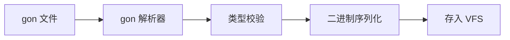

# 配置表系统

Gnosis 配置表系统位于 `Gnosis.Asset` 包的 `Format` 子模块中，使用 `gg-object` (gon) 格式定义结构化配置数据。

---

## 相关包与子模块

| 包 | 子模块 | 职责 |
|:---|:---|:---|
| `Gnosis.Asset` | `Format` | gon 格式解析器 |
| `Gnosis.Asset` | `VFS` | 配置文件的虚拟文件系统访问 |
| `Gnosis.Asset` | `Import` | 配置表的导入与依赖收集 |
| `Gnosis.Asset` | `Cache` | 配置表的构建缓存 |
| `Gnosis.Storage` | `Pref` | 玩家偏好键值存储 |

---

## gg-object (gon) 格式

gon 是 JSON 的超集，专为游戏配置设计。

### 格式特点

| 特性 | 描述 |
|------|------|
| JSON 兼容 | 所有合法 JSON 都是合法 gon |
| 类型标注 | 支持字段类型声明 |
| 引用 | 支持跨文件引用 |
| 注释 | 支持行注释 `#` 和块注释 `/* */` |
| 表达式 | 支持简单数学表达式 |
| 枚举 | 支持枚举类型定义 |

### 示例

```gon
# 角色配置表
CharacterTable: {
    id: i32,
    name: string,
    hp: f32,
    attack: f32,
    defense: f32,
    skills: [i32],
}

characters: [
    { id: 1001, name: "战士", hp: 1000.0, attack: 50.0, defense: 30.0, skills: [2001, 2002] },
    { id: 1002, name: "法师", hp: 600.0, attack: 80.0, defense: 10.0, skills: [2003, 2004] },
    { id: 1003, name: "治疗", hp: 800.0, attack: 30.0, defense: 20.0, skills: [2005, 2006] },
]

# 技能配置表
SkillTable: {
    id: i32,
    name: string,
    damage: f32,
    cooldown: f32,
    element: string,
}

skills: [
    { id: 2001, name: "猛击", damage: 80.0, cooldown: 5.0, element: "physical" },
    { id: 2002, name: "盾击", damage: 40.0, cooldown: 3.0, element: "physical" },
    { id: 2003, name: "火球", damage: 120.0, cooldown: 8.0, element: "fire" },
    { id: 2004, name: "冰锥", damage: 90.0, cooldown: 6.0, element: "ice" },
    { id: 2005, name: "治愈", damage: -100.0, cooldown: 10.0, element: "holy" },
    { id: 2006, name: "护盾", damage: 0.0, cooldown: 15.0, element: "holy" },
]
```

---

## 配置表在 gg-script 中的使用

### 导入配置表

```tsx
import "tables/characters.gon" as CharTable;
import "tables/skills.gon" as SkillTable;

system BattleSystem {
    query = Query.all(CombatState);

    on_update(delta: f32) {
        <% foreach (var entity in query) { %>
            var char_data = CharTable.characters[entity.char_id];
            var skill_data = SkillTable.skills[entity.active_skill];
            
            # 应用技能伤害
            entity.hp -= skill_data.damage * (1.0 - char_data.defense / 200.0);
        <% } %>
    }
}
```

### 编译时验证

配置表在编译时（阶段一）进行类型检查：

- 字段类型与声明一致
- 引用 ID 存在性校验
- 数值范围校验

---

## 配置表管线

### 导入流程



### 增量构建

`Gnosis.Asset.Cache` 子模块支持配置表的增量构建：

- 文件哈希比对，仅重新处理变更的配置表
- 依赖图追踪，变更传播到依赖方

---

## 与其他系统的关系

| 系统 | 关系 |
|------|------|
| `Gnosis.ECS` | 配置表数据可作为组件初始值 |
| `Gnosis.Network` | 配置表在服务器和客户端间同步 |
| `Gnosis.Storage` | 运行时配置覆盖（玩家偏好） |
| `Gnosis.Security` | 配置表完整性校验 |
