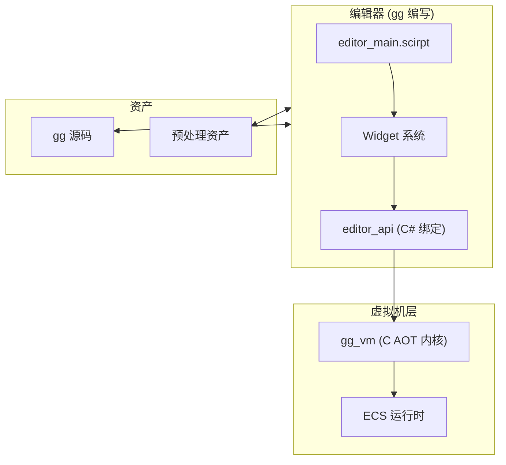

# 编辑器架构与 Widget 系统

本文档介绍 Gnosis 引擎编辑器的架构设计，以及 Widget 系统的使用方法。

## 设计理念

Gnosis 引擎的编辑器完全由 gg 语言编写，运行于 gg 虚拟机之上。这一设计带来以下优势：

| 特性 | 描述 |
| :--- | :--- |
| 自举能力 | 编辑器与游戏逻辑使用同一语言，降低学习成本 |
| 热重载支持 | 编辑器代码修改后可即时生效，无需重启 |
| 跨平台一致 | 编辑器行为在所有平台保持一致 |
| 可扩展性 | 开发者可用 gg 语言扩展编辑器功能 |

## 架构概览



### 核心组件

| 组件 | 文件 | 职责 |
| :--- | :--- | :--- |
| 编辑器入口 | `editor_main.scirpt` | 初始化编辑器，创建主场景 |
| Widget 系统 | `widgets/*.scirpt` | UI 组件定义与渲染 |
| 编辑器 API | `editor_api` | C# 绑定，提供底层能力 |
| 热重载服务 | `hot_reload_service` | 监控文件变更，触发重载 |

## Widget 系统

Widget 是编辑器 UI 的基本构建单元，专门用于绘制编辑器用户界面。

### Widget 定义

```tsx
widget Inspector {
    property selected_entity: Entity;

    render() {
        <% foreach (var comp in get_components_of(selected_entity)) { %>
            <collapsible_section title="<%= comp.name %>">
                <% foreach (var prop in comp.properties) { %>
                    <% if (prop.type == "float") { %>
                        <float_field 
                            label="<%= prop.name %>"
                            value="<%= selected_entity.get_float(comp.name, prop.name) %>"
                            on_change="(v) => selected_entity.set_float(comp.name, prop.name, v)"
                        />
                    <% } else if (prop.type == "int") { %>
                        <int_field 
                            label="<%= prop.name %>"
                            value="<%= selected_entity.get_int(comp.name, prop.name) %>"
                            on_change="(v) => selected_entity.set_int(comp.name, prop.name, v)"
                        />
                    <% } else if (prop.type == "string") { %>
                        <text_field 
                            label="<%= prop.name %>"
                            value="<%= selected_entity.get_string(comp.name, prop.name) %>"
                            on_change="(v) => selected_entity.set_string(comp.name, prop.name, v)"
                        />
                    <% } else if (prop.type == "bool") { %>
                        <checkbox 
                            label="<%= prop.name %>"
                            value="<%= selected_entity.get_bool(comp.name, prop.name) %>"
                            on_change="(v) => selected_entity.set_bool(comp.name, prop.name, v)"
                        />
                    <% } %>
                <% } %>
            </collapsible_section>
        <% } %>
    }
}
```

### 内置 Widget

| Widget | 用途 |
| :--- | :--- |
| `widget_main_menu` | 主菜单栏 |
| `widget_toolbar` | 工具栏 |
| `widget_content_browser` | 资产浏览器 |
| `widget_viewport_3d` | 3D 视口 |
| `widget_inspector` | 属性检查器 |
| `widget_hierarchy` | 场景层级树 |
| `widget_console` | 控制台输出 |
| `widget_dock_layout` | 可停靠布局容器 |

### Widget 属性

```tsx
widget MyWidget {
    property title: string = "默认标题";
    property visible: bool = true;
    property width: float = 300.0;
    property height: float = 400.0;

    render() {
        if (!this.visible) return;
        // 渲染逻辑
    }
}
```

### Widget 生命周期

```tsx
widget LifecycleWidget {
    on_create() {
        // Widget 创建时调用
    }

    on_mount() {
        // Widget 挂载到 UI 树时调用
    }

    render() {
        // 每帧调用，绘制 UI
    }

    on_unmount() {
        // Widget 从 UI 树移除时调用
    }

    on_destroy() {
        // Widget 销毁时调用
    }
}
```

## Widget 与 Component 的区别

Widget 和 Component 是 gg 语言中两个截然不同的概念，必须明确区分。

> **重要**：gg 引擎中还存在第三种 UI 概念——**Game UI**。Widget 专指编辑器 UI，Game UI 专指游戏运行时 UI（HUD、血条等），二者是两套完全独立的体系。详见 [gg-widget 语言指南 - Game UI 系统](../languages/gg-widget.md#game-ui-系统)。

> Widget、Component 与 Game UI 的详细区分请参阅 [gg-widget 语言指南 - 关键区分：Widget 与 Game UI](../languages/gg-widget.md#⚠️-关键区分widget-与-game-ui)。

## 编辑器主场景

编辑器启动时加载主场景，初始化所有编辑器组件：

```tsx
export scene EditorMain {
    var ui_root: Widget;

    on_load() {
        editor_core.init();
        this.ui_root = widget_dock_layout.create({
            layout: "default",
            children: [
                widget_main_menu.create({
                    items: [
                        { label: "文件", submenu: this.create_file_menu() },
                        { label: "编辑", submenu: this.create_edit_menu() },
                        { label: "视图", submenu: this.create_view_menu() },
                        { label: "帮助", submenu: this.create_help_menu() }
                    ]
                }),
                widget_toolbar.create({
                    tools: [
                        { icon: "select", action: "tool_select" },
                        { icon: "move", action: "tool_move" },
                        { icon: "rotate", action: "tool_rotate" },
                        { icon: "scale", action: "tool_scale" }
                    ]
                }),
                widget_content_browser.create({
                    root_path: "assets://"
                }),
                widget_viewport_3d.create({
                    camera_mode: "perspective"
                }),
                widget_inspector.create(),
                widget_hierarchy.create(),
                widget_console.create()
            ]
        });
    }

    on_update(delta: float) {
        editor_input.process_shortcuts();
        this.update_status_bar();
    }

    function create_file_menu(): MenuItem[] {
        return [
            { label: "新建项目", shortcut: "Ctrl+N", action: "file_new_project" },
            { label: "打开项目", shortcut: "Ctrl+O", action: "file_open_project" },
            { type: "separator" },
            { label: "保存", shortcut: "Ctrl+S", action: "file_save" },
            { label: "另存为...", shortcut: "Ctrl+Shift+S", action: "file_save_as" },
            { type: "separator" },
            { label: "退出", shortcut: "Alt+F4", action: "file_exit" }
        ];
    }
}
```

## Inspector Widget 完整示例

以下是一个功能完整的 Inspector Widget 实现：

```tsx
widget Inspector {
    property selected_entity: Entity;
    property expanded_sections: map<string, bool> = {};

    render() {
        if (this.selected_entity == null) {
            this.render_empty_state();
            return;
        }

        <scroll_view>
            <header>
                <text text="<%= this.selected_entity.name %>" style="entity_name" />
                <text text="<%= 'Entity ID: ' + this.selected_entity.id %>" style="entity_id" />
            </header>

            <transform_section 
                entity="<%= this.selected_entity %>"
                expanded="<%= this.expanded_sections.get('Transform', true) %>"
                on_toggle="(expanded) => this.toggle_section('Transform', expanded)"
            />

            <% foreach (var comp in get_components_of(this.selected_entity)) { %>
                <component_section 
                    component="<%= comp %>"
                    entity="<%= this.selected_entity %>"
                    expanded="<%= this.expanded_sections.get(comp.name, true) %>"
                    on_toggle="(expanded) => this.toggle_section(comp.name, expanded)"
                    on_remove="() => this.remove_component(comp.name)"
                />
            <% } %>

            <add_component_button on_click="() => this.show_add_component_dialog()" />
        </scroll_view>
    }

    function toggle_section(section_name: string, expanded: bool) {
        this.expanded_sections.set(section_name, expanded);
    }

    function remove_component(comp_name: string) {
        if (comp_name == "Transform") {
            show_warning("Transform 组件无法移除");
            return;
        }
        this.selected_entity.remove(comp_name);
    }

    function show_add_component_dialog() {
        var available_components = get_all_component_types();
        show_popup("添加组件", available_components, (selected) => {
            this.selected_entity.add(create_component(selected));
        });
    }

    function render_empty_state() {
        <center>
            <text text="未选中任何实体" style="hint" />
            <text text="点击场景中的对象或从层级面板选择" style="hint_small" />
        </center>
    }
}

widget component_section {
    property component: ComponentInfo;
    property entity: Entity;
    property expanded: bool;
    property on_toggle: function;
    property on_remove: function;

    render() {
        <collapsible_section 
            title="<%= this.component.name %>"
            expanded="<%= this.expanded %>"
            on_toggle="<%= this.on_toggle %>"
            header_right={
                <button 
                    icon="remove" 
                    on_click="<%= this.on_remove %>"
                    tooltip="移除组件"
                />
            }
        >
            <% foreach (var prop in this.component.properties) { %>
                <property_field 
                    label="<%= prop.name %>"
                    type="<%= prop.type %>"
                    value="<%= this.entity.get_value(this.component.name, prop.name) %>"
                    on_change="(v) => this.entity.set_value(this.component.name, prop.name, v)"
                />
            <% } %>
        </collapsible_section>
    }
}

widget property_field {
    property label: string;
    property type: string;
    property value: any;
    property on_change: function;

    render() {
        <row>
            <label text="<%= this.label %>" width="100" />
            <% if (this.type == "float") { %>
                <float_input 
                    value="<%= this.value %>"
                    on_change="<%= this.on_change %>"
                />
            <% } else if (this.type == "int") { %>
                <int_input 
                    value="<%= this.value %>"
                    on_change="<%= this.on_change %>"
                />
            <% } else if (this.type == "string") { %>
                <text_input 
                    value="<%= this.value %>"
                    on_change="<%= this.on_change %>"
                />
            <% } else if (this.type == "bool") { %>
                <checkbox 
                    value="<%= this.value %>"
                    on_change="<%= this.on_change %>"
                />
            <% } else if (this.type == "vector3") { %>
                <vector3_input 
                    value="<%= this.value %>"
                    on_change="<%= this.on_change %>"
                />
            <% } else if (this.type == "color") { %>
                <color_picker 
                    value="<%= this.value %>"
                    on_change="<%= this.on_change %>"
                />
            <% } else if (this.type == "entity_ref") { %>
                <entity_picker 
                    value="<%= this.value %>"
                    on_change="<%= this.on_change %>"
                />
            <% } else if (this.type == "asset_ref") { %>
                <asset_picker 
                    value="<%= this.value %>"
                    on_change="<%= this.on_change %>"
                    asset_type="<%= this.asset_type %>"
                />
            <% } else { %>
                <text text="[不支持的类型: <%= this.type %>]" style="error" />
            <% } %>
        </row>
    }
}
```

## 编辑器 API

编辑器通过 C# 绑定提供底层能力：

### 核心 API

| API | 描述 |
| :--- | :--- |
| `editor_core.init()` | 初始化编辑器核心 |
| `editor_input.process_shortcuts()` | 处理快捷键 |
| `editor_selection.get()` | 获取当前选中对象 |
| `editor_selection.set(entity)` | 设置选中对象 |
| `editor_scene.save()` | 保存当前场景 |
| `editor_scene.load(path)` | 加载场景 |
| `editor_asset.import(path)` | 导入资产 |
| `editor_undo.record(object)` | 记录撤销状态 |
| `editor_redo.apply()` | 应用重做 |

### 热重载 API

```tsx
function on_file_changed(file_path: string) {
    if (file_path.ends_with(".scirpt")) {
        var module_name = get_module_name(file_path);
        var new_bytecode = compile_module(file_path);
        vm_reload_module(module_name, new_bytecode);
        refresh_inspector();
    }
}
```

## 扩展编辑器

开发者可以通过 gg 语言扩展编辑器功能：

### 创建自定义 Widget

```tsx
widget CustomPanel {
    property data: CustomData;

    render() {
        <panel title="自定义面板">
            <text text="这是一个自定义编辑器扩展" />
        </panel>
    }
}
```

### 注册编辑器扩展

```tsx
export function register_editor_extensions() {
    editor.register_widget("custom_panel", CustomPanel);
    editor.register_menu_item("视图/自定义面板", () => {
        editor.show_widget("custom_panel");
    });
}
```

## 最佳实践

### Widget 设计原则

| 原则 | 描述 |
| :--- | :--- |
| 单一职责 | 每个 Widget 只负责一个 UI 功能 |
| 属性驱动 | 使用 property 管理状态，避免全局变量 |
| 事件回调 | 使用回调函数处理用户交互 |
| 延迟渲染 | 复杂 Widget 使用虚拟滚动优化性能 |

### 性能优化

```tsx
widget OptimizedList {
    property items: Item[];
    property visible_range: Range;

    render() {
        <virtual_list 
            total_count="<%= this.items.length %>"
            visible_range="<%= this.visible_range %>"
            on_scroll="(range) => this.visible_range = range"
        >
            <% foreach (var item in this.items.slice(this.visible_range.start, this.visible_range.end)) { %>
                <list_item data="<%= item %>" />
            <% } %>
        </virtual_list>
    }
}
```

## 下一步

- 阅读 [gg 语言指南](../languages/gg-script.md) 学习 gg 语法
- 阅读 [资产管线](architecture.md) 了解资产预处理流程
- 查看 [示例项目](../../examples/) 了解编辑器扩展实践
