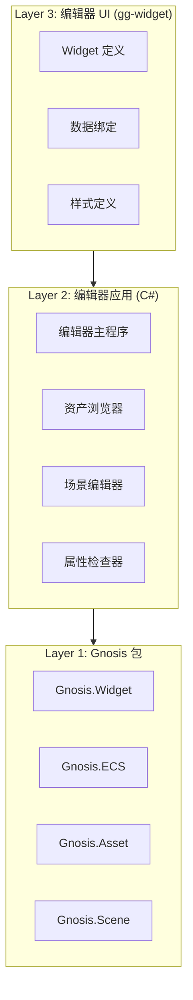

# 编辑器架构

Gnosis 编辑器基于 `Gnosis.Widget` 包构建，UI 使用 `gg-widget` 语言编写。编辑器本身是 Layer 2 的 C# 应用程序，但其 UI 组件由 gg-widget 定义。

---

## 两个 UI 系统的绝对边界

| 特征 | `Gnosis.Widget` | `Gnosis.GameUI` |
|:---|:---|:---|
| **目标用户** | 引擎开发者、工具开发者 | 游戏开发者、玩家 |
| **运行环境** | 编辑器进程（C# 宿主） | 游戏运行时（gg-script 脚本） |
| **渲染模式** | 保留模式（Retained Mode） | 即时模式为主（Immediate Mode）或混合 |
| **典型控件** | 属性面板、资产浏览器、曲线编辑器 | 血条、技能图标、对话框、背包格 |
| **数据绑定** | `gg-widget` 语法，双向绑定 | `gg-script` 直接操作 UI 组件 |
| **性能目标** | 低刷新率（30fps 足够），高数据密度 | 高刷新率（60fps+），低延迟交互 |
| **依赖关系** | 不依赖 ECS | 依赖 ECS（通过 UI 组件与系统） |

**致命错误示例**：

- ❌ 在游戏中使用 `Gnosis.Widget` 画血条 → **导致性能灾难，且无法与 gg-script 交互**
- ❌ 在编辑器工具中硬编码 `Gnosis.GameUI` 控件 → **失去保留模式的布局优势，开发效率低下**

---

## Gnosis.Widget 子模块

| 子模块 | 职责 | 设计理由 |
|:---|:---|:---|
| `Element` | 控件基类、布局元素、事件响应 | UI 的基本构建块 |
| `Render` | 保留模式渲染、批处理、裁剪 | 编辑器 UI 的绘制 |
| `Style` | 样式表、主题、颜色管理 | UI 外观的可定制化 |
| `Layout` | 盒模型、弹性布局、网格布局 | UI 的自动布局计算 |
| `Binding` | 数据绑定、视图模型、响应式 | gg-widget 与 UI 的连接 |
| `Window` | 窗口管理、停靠系统、分割视图 | 多窗口编辑器的基础 |
| `Control` | 按钮、滑块、文本框、树视图等标准控件 | 常用 UI 控件的实现 |

---

## 编辑器架构



---

## 编辑器窗口系统

### 窗口管理

`Gnosis.Widget.Window` 子模块提供：

| 功能 | 描述 |
|------|------|
| 窗口创建 | 创建可拖拽、可缩放的编辑器窗口 |
| 停靠系统 | 窗口可停靠到编辑器边缘 |
| 分割视图 | 窗口可水平/垂直分割 |
| 标签页 | 多窗口可合并为标签页 |

### 标准编辑器窗口

| 窗口 | 描述 |
|------|------|
| 场景视图 | 3D 场景编辑 |
| 游戏视图 | 游戏运行预览 |
| 属性检查器 | 选中对象的属性编辑 |
| 资产浏览器 | 资产文件浏览与管理 |
| 层级面板 | 场景层级树 |
| 控制台 | 日志输出与命令 |
| 动画编辑器 | 动画曲线编辑 |
| 着色器编辑器 | 着色器节点编辑 |

---

## gg-widget 语言

编辑器 UI 使用 `gg-widget` 语言定义，这是一种声明式 UI 语言。

### Widget 定义

```tsx
widget Inspector {
    property selected_entity: Entity;

    render() {
        <panel title="Inspector">
            <% foreach (var comp in get_components_of(selected_entity)) { %>
                <property_field 
                    name="<%= comp.name %>"
                    value="<%= comp.value %>"
                />
            <% } %>
        </panel>
    }
}
```

### 数据绑定

`gg-widget` 支持双向数据绑定：

```tsx
widget TransformEditor {
    property transform: Transform;

    render() {
        <group title="Transform">
            <vec3_field 
                label="Position"
                value={transform.position}
            />
            <vec3_field 
                label="Rotation"
                value={transform.rotation}
            />
            <vec3_field 
                label="Scale"
                value={transform.scale}
            />
        </group>
    }
}
```

### 样式系统

`Gnosis.Widget.Style` 子模块提供样式表支持：

```css
panel {
    background: var(--surface);
    border: 1px solid var(--border);
    padding: 8px;
}

property_field {
    layout: horizontal;
    spacing: 4px;
}
```

---

## 编辑器扩展

### 扩展点

编辑器通过 `Gnosis.Plugin.Extension` 子模块提供扩展点注册：

| 扩展点 | 描述 |
|--------|------|
| 菜单项 | 添加自定义菜单项 |
| 属性绘制器 | 自定义属性编辑器 |
| 资产导入器 | 支持新的资产格式 |
| 场景视图叠加 | 在场景视图上绘制自定义内容 |
| 检查器面板 | 添加自定义检查器标签页 |

### 创建编辑器扩展

```tsx
plugin MyEditorExtension {
    provides_extensions = [
        "menu_item:Tools/My Tool",
        "inspector_tab:My Component"
    ];

    widget MyToolWindow {
        render() {
            <window title="My Tool">
                <text value="Hello from extension!" />
            </window>
        }
    }
}
```

---

## 编辑器与运行时的关系

编辑器是 Layer 2 的 C# 应用程序，它：

1. **调用 Gnosis 包**：直接使用 `Gnosis.ECS`、`Gnosis.Asset`、`Gnosis.Scene` 等 API
2. **运行 gg 虚拟机**：通过 `Gnosis.Runtime` 执行 gg-widget 代码
3. **管理构建管线**：通过 `Gnosis.Toolchain` 执行多阶段构建
4. **不包含游戏逻辑**：游戏逻辑属于 Layer 3，由 gg-script 编写
