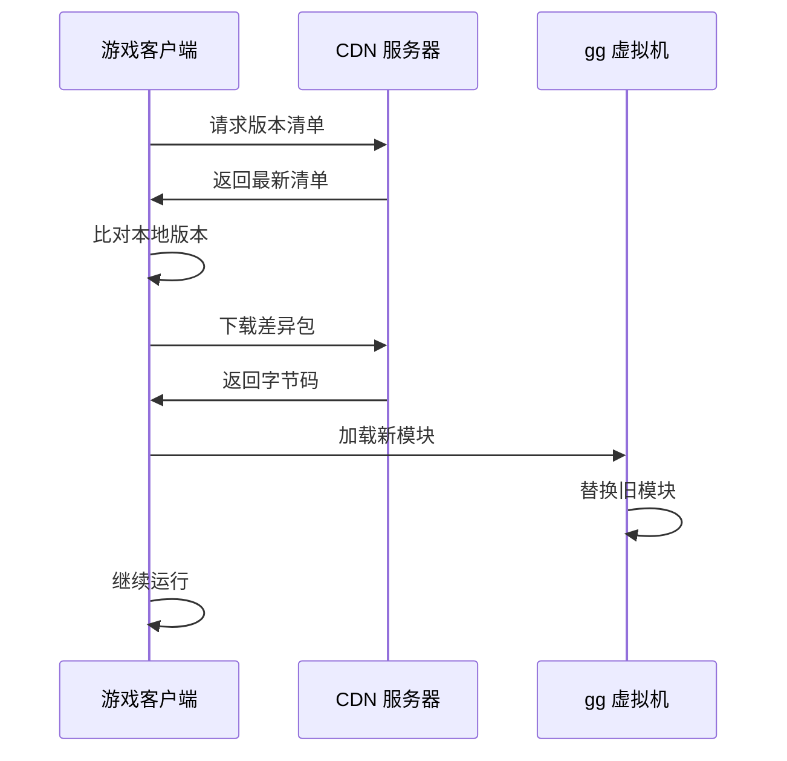

# 热更新与热重载

Gnosis 的热更新机制由 `Gnosis.Runtime` 包的 `HotReload` 子模块支持，结合 `Gnosis.Asset` 包的 VFS 实现运行时代码替换。

---

## 两种热更新模式

| 模式 | 场景 | 触发方式 | 机制 |
|------|------|----------|------|
| **热重载** | 开发期 | 文件变更自动触发 | 模块替换 + 状态迁移 |
| **热更新** | 发布后 | 服务器推送 / 客户端拉取 | 字节码下载 + 模块加载 |

---

## 热重载（开发期）

### 工作流程


### 状态迁移

热重载时需要将旧模块的状态迁移到新模块：

| 迁移类型 | 描述 |
|----------|------|
| 字段保留 | 同名同类型的字段自动迁移 |
| 字段新增 | 新字段使用默认值 |
| 字段删除 | 旧字段数据丢弃 |
| 字段重命名 | 需要迁移映射表 |

### Gnosis.Runtime.HotReload 子模块

| 功能 | 描述 |
|------|------|
| 元数据比对 | 比较新旧模块的类型、字段、方法签名 |
| 状态快照 | 保存旧模块的运行时状态 |
| 状态迁移 | 将快照中的数据映射到新模块 |
| 模块替换 | 原子性地替换 VM 中的模块 |

---

## 热更新（发布后）

### 合规性说明

gg 引擎的热更新机制完全符合 iOS App Store 和各主机平台的政策：

- **虚拟机是 AOT 编译的本地代码**，属于应用程序本体
- **下载的 `.code` 文件是数据**，由虚拟机解释执行
- **不涉及可执行代码的动态生成**（无 JIT）
- **等价于下载新的关卡数据或脚本配置**

### 更新流程



### 版本清单格式

```json
{
    "version": "1.2.3",
    "modules": [
        {
            "name": "game_logic",
            "hash": "sha256:abc123...",
            "url": "https://cdn.example.com/v1.2.3/game_logic.code",
            "size": 102400
        }
    ]
}
```

### 差异更新

为减少下载量，支持差异更新：

| 策略 | 描述 |
|------|------|
| 全量替换 | 下载完整模块 |
| 二进制差异 | 下载 bsdiff 补丁 |
| 模块级差异 | 仅下载变更的模块 |

---

## 虚拟机层面的支持

gg 虚拟机（`Gnosis.Runtime.VM`）为热更新提供以下原生支持：

### 模块加载

- 支持运行时动态加载新模块
- 模块加载是原子操作，不会中断正在执行的代码
- 旧模块的引用在新模块加载后自动切换

### 栈保存与恢复

- 协程的栈帧可以保存为快照
- 热重载时恢复栈帧，继续执行
- `Gnosis.Runtime.Coroutine` 子模块与热重载深度集成

### 类型兼容性

| 变更类型 | 兼容性 | 处理方式 |
|----------|--------|----------|
| 新增方法 | 兼容 | 直接加载 |
| 删除方法 | 不兼容 | 需要迁移映射 |
| 修改签名 | 不兼容 | 需要迁移映射 |
| 新增字段 | 兼容 | 默认值填充 |
| 删除字段 | 兼容 | 数据丢弃 |
| 修改字段类型 | 不兼容 | 需要迁移映射 |

---

## 沙箱隔离

`Gnosis.Runtime.Sandbox` 子模块为热更新代码提供安全隔离：

| 能力 | 描述 |
|------|------|
| 权限控制 | 限制热更新代码的文件/网络访问 |
| 资源配额 | 限制内存和 CPU 使用 |
| 异常隔离 | 热更新代码的异常不影响主程序 |
| 回滚机制 | 加载失败时自动回滚到旧版本 |

---

## 与 Plugin 系统的关系

`Gnosis.Plugin` 包管理插件的加载与隔离，与热更新机制互补：

| 机制 | 触发时机 | 范围 |
|------|----------|------|
| 热重载 | 开发期文件变更 | 已加载模块的替换 |
| 热更新 | 发布后版本推送 | 已加载模块的替换 |
| 插件加载 | 运行时按需 | 新插件的首次加载 |

详见 [架构详解 - Gnosis.Plugin](../maintenance/architecture.md)。
