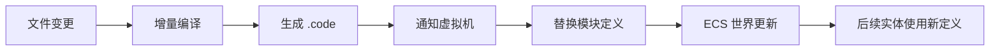
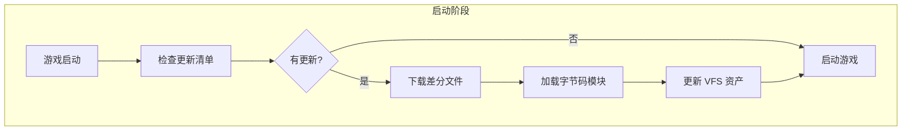
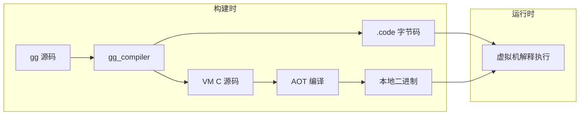

# 热更新与热重载

本文档介绍 Gnosis 引擎的热更新机制，包括开发期的热重载和发布后的热更新流程。

## 概述

Gnosis 引擎通过**字节码解释**实现热更新能力，完全绕过 JIT 限制，支持 iOS、主机等所有主流平台。

### 核心优势

| 特性 | 描述 |
| :--- | :--- |
| **零 JIT 依赖** | 字节码由 AOT 编译的虚拟机解释执行，无需运行时编译 |
| **跨平台兼容** | 完全符合 iOS App Store、PlayStation、Xbox 等商店政策 |
| **增量更新** | 仅下载变更的 `.code` 模块和资产差分文件 |
| **无缝切换** | 运行时动态加载，无需重启游戏 |

## 热重载（开发期）

热重载用于开发阶段，当源码变更时自动编译并更新运行中的游戏。

### 工作流程



### C# 元语言热重载服务

```csharp
public static class HotReloadService
{
    public static void on_file_changed(string gg_file)
    {
        var new_bytecode = GGCompiler.compile_single(
            gg_file, 
            current_arch, 
            current_macros
        );
        
        EditorVM.call(
            "vm_reload_module", 
            Path.GetFileNameWithoutExtension(gg_file), 
            new_bytecode
        );
    }
}
```

### 虚拟机热替换逻辑

虚拟机内核（C 语言）处理模块替换：

```c
void vm_reload_module(
    VMState* vm, 
    const char* name, 
    const uint8_t* new_bytecode, 
    size_t size
) {
    Module* old_mod = find_module(vm, name);
    Module* new_mod = parse_bytecode(new_bytecode, size);
    
    replace_module(vm->modules, name, new_mod);
    
    world_update_definitions(vm->world, old_mod, new_mod);
}
```

### 使用示例

在编辑器中修改组件定义：

```tsx
export component PlayerStats {
    health: float;
    mana: float;
    // 新增字段
    stamina: float;
}

export system CombatSystem {
    on_update(delta: float) {
        // 修改逻辑
        <% foreach (var (stats,) in Query.all(PlayerStats)) { %>
            stats.stamina += delta * 0.5;
        <% } %>
    }
}
```

保存后，编辑器自动：
1. 检测文件变更
2. 增量编译新模块
3. 替换内存中的定义
4. 新创建的实体使用更新后的组件结构

## 热更新（发布后）

热更新用于已发布的游戏，允许在不重新提交商店审核的情况下更新游戏内容。

### 工作流程



### 客户端启动流程

```tsx
export function main() {
    var manifest = http.get("https://cdn.example.com/latest.json");
    
    foreach (var diff in manifest.diffs) {
        var bytes = http.download(diff.url);
        vm.load_module(diff.name, bytes);
    }
    
    foreach (var asset_diff in manifest.asset_diffs) {
        vfs.update_file(
            asset_diff.path, 
            http.download(asset_diff.url)
        );
    }
    
    game.start();
}
```

### 更新清单格式

```json
{
    "version": "1.2.3",
    "diffs": [
        {
            "name": "combat_system",
            "url": "https://cdn.example.com/v1.2.3/combat_system.code",
            "hash": "sha256:abc123..."
        },
        {
            "name": "quest_system",
            "url": "https://cdn.example.com/v1.2.3/quest_system.code",
            "hash": "sha256:def456..."
        }
    ],
    "asset_diffs": [
        {
            "path": "textures/ui/new_panel.texture",
            "url": "https://cdn.example.com/v1.2.3/new_panel.texture",
            "hash": "sha256:789..."
        }
    ]
}
```

### 虚拟文件系统 (VFS)

VFS 是热更新的基础设施，支持运行时文件覆盖：

```
┌─────────────────────────────────────────────────────────────┐
│                     VFS 层次结构                              │
│  ┌──────────────────────────────────────────────────────┐   │
│  │              热更新覆盖层 (优先级最高)                  │   │
│  │  combat_system.code  │  new_panel.texture             │   │
│  └──────────────────────────────────────────────────────┘   │
│                          ↓                                   │
│  ┌──────────────────────────────────────────────────────┐   │
│  │              基础资产层 (打包时嵌入)                    │   │
│  │  core.code  │  player.texture  │  ui.texture          │   │
│  └──────────────────────────────────────────────────────┘   │
└─────────────────────────────────────────────────────────────┘
```

## 与 JIT 限制的无关性

### 问题背景

iOS、PlayStation、Xbox 等平台禁止或限制 JIT（即时编译）：

| 平台 | JIT 限制 | 原因 |
| :--- | :--- | :--- |
| iOS | 完全禁止 | 安全策略，内存页不可同时可写可执行 |
| PlayStation | 严格限制 | 安全审查要求 |
| Xbox | 严格限制 | 安全审查要求 |
| Nintendo Switch | 严格限制 | 安全审查要求 |

### Gnosis 引擎的解决方案

Gnosis 引擎通过**字节码解释**完全绕过 JIT 限制：



### 关键设计

| 设计点 | 说明 |
| :--- | :--- |
| **虚拟机 AOT 编译** | 虚拟机内核为纯 C 代码，经 AOT 编译为本地二进制 |
| **字节码即数据** | `.code` 文件是纯数据，由虚拟机读取解释 |
| **无动态代码生成** | 运行时不生成任何可执行代码 |
| **符合商店政策** | 字节码下载被视为资源加载，非代码注入 |

### 平台兼容性

```c
void vm_run(VMState* vm) {
    const uint8_t* ip = vm->ip;
    static void* dispatch[] = { 
        &&OP_HALT, 
        &&OP_ADD_F, 
        &&OP_CALL_NATIVE, 
        ... 
    };
    goto *dispatch[*ip++];
    
OP_ADD_F: {
    float b = vm->stack[--vm->sp];
    float a = vm->stack[--vm->sp];
    vm->stack[vm->sp++] = a + b;
    goto *dispatch[*ip++];
}
}
```

上述虚拟机代码：
- 纯 C 语言实现
- 无外部依赖
- 可被任何 C 编译器编译
- 生成的二进制完全符合各平台要求

### 与其他方案对比

| 方案 | iOS 支持 | 主机支持 | 性能 | 热更新能力 |
| :--- | :--- | :--- | :--- | :--- |
| **Lua** | ✅ | ✅ | 中等 | 完整 |
| **ILRuntime** | ⚠️ 受限 | ⚠️ 受限 | 较低 | 完整 |
| **HybridCLR** | ❌ 禁止 | ❌ 禁止 | 较高 | 完整 |
| **Gnosis 字节码** | ✅ | ✅ | 高 | 完整 |

## 最佳实践

### 模块划分

将游戏逻辑划分为独立模块，便于增量更新：

```
modules/
├── core/              # 核心系统，更新频率低
│   ├── ecs_core.scirpt
│   └── input.scirpt
├── gameplay/          # 游戏玩法，更新频率高
│   ├── combat.scirpt
│   ├── quest.scirpt
│   └── skill.scirpt
└── ui/                # UI 系统，更新频率高
    ├── hud.scirpt
    └── menu.scirpt
```

### 版本兼容性

```tsx
export function check_compatibility(manifest_version: string): bool {
    var current = vm.get_api_version();
    var required = parse_version(manifest_version);
    
    if (required.major != current.major) {
        log.error("不兼容的主版本号，需要完整更新");
        return false;
    }
    
    return true;
}
```

### 回滚机制

```tsx
export function apply_update_with_rollback(manifest: UpdateManifest) {
    var backup = create_backup();
    
    try {
        apply_update(manifest);
        if (!verify_integrity()) {
            throw "完整性校验失败";
        }
    } catch (e) {
        log.error("更新失败: " + e);
        restore_backup(backup);
    }
}
```

## 总结

Gnosis 引擎的热更新机制通过多阶段编程范式实现：

| 阶段 | 热重载（开发期） | 热更新（发布后） |
| :--- | :--- | :--- |
| 触发方式 | 文件变更自动触发 | 启动时检查清单 |
| 编译时机 | 增量编译 | 预编译好的字节码 |
| 分发方式 | 本地内存替换 | CDN 下载 |
| 适用场景 | 开发调试 | 生产环境更新 |

核心优势：
- **零 JIT 依赖**：字节码解释，无运行时编译
- **全平台兼容**：iOS、主机、Web 均可使用
- **增量更新**：仅下载变更部分，节省带宽
- **无缝体验**：运行时加载，无需重启

## 下一步

- 阅读 [架构设计](architecture.md) 了解多阶段编程模型
- 阅读 [gg 语言指南](../languages/gg-script.md) 学习模块划分
- 阅读 [网络架构](network.md) 了解更新分发策略
