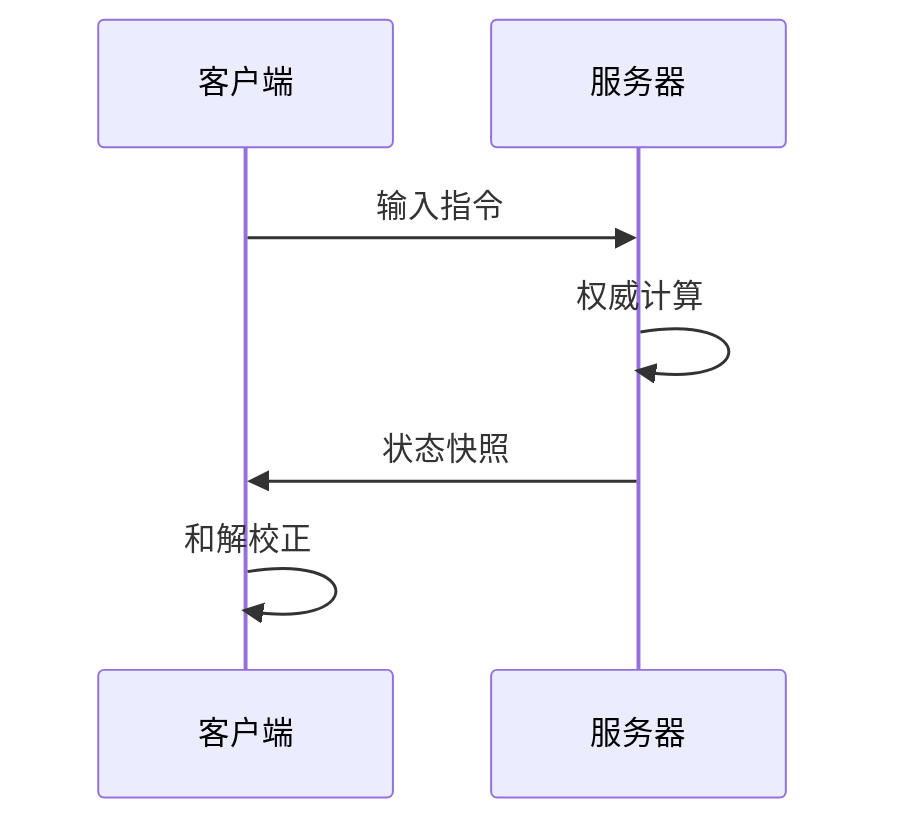
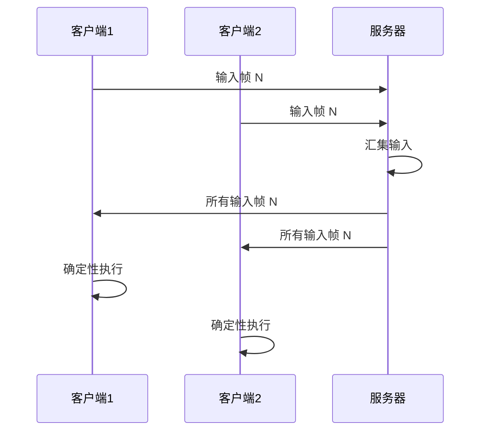

# 网络架构

Gnosis 网络系统位于 `Gnosis.Network` 包中，支持帧同步与状态同步的融合架构。

---

## Gnosis.Network 子模块

| 子模块 | 职责 | 设计理由 |
|:---|:---|:---|
| `Transport` | UDP / WebSocket / KCP 传输层抽象 | 网络通信的基础通道 |
| `Channel` | 可靠/不可靠信道、有序/无序 | 不同数据类型的传输策略 |
| `Replication` | 状态同步、增量更新、所有权 | 多人游戏的核心同步机制 |
| `RPC` | 远程过程调用、序列化、路由 | 客户端与服务器的方法调用 |
| `Lobby` | 大厅服务接口、房间管理、匹配 | 多人游戏的社交基础设施抽象 |
| `Serialization` | 网络序列化、比特流、压缩 | 网络传输的数据格式 |
| `Prediction` | 客户端预测、回滚、和解 | 降低网络延迟的感知 |
| `Metrics` | 网络延迟、丢包率、带宽统计 | 网络质量的监控 |

---

## 双模式同步架构

Gnosis 支持帧同步与状态同步两种模式，可在同一游戏中无缝切换。

### 状态同步



**特点**：
- 服务器是唯一真相源
- 客户端仅发送输入，接收状态
- 天然反作弊（服务器校验一切）
- 适用于 RPG、FPS 等需要服务器权威的场景

### 帧同步



**特点**：
- 所有客户端执行相同逻辑
- 服务器仅转发输入
- 带宽需求低
- 适用于 RTS、格斗等确定性逻辑场景

### 模式对比

| 特性 | 状态同步 | 帧同步 |
|------|----------|--------|
| **权威方** | 服务器 | 输入汇集后本地执行 |
| **带宽需求** | 较高（状态快照） | 较低（仅输入） |
| **延迟容忍** | 较高 | 较低 |
| **反作弊** | 天然服务器校验 | 需要同步哈希校验 |
| **适用场景** | RPG、FPS | RTS、格斗 |
| **回滚** | 不需要 | 需要状态回滚 |

---

## 传输层

### 传输后端

| 后端 | 协议 | 适用场景 |
|------|------|----------|
| UDP | 无连接 | 实时游戏数据 |
| WebSocket | TCP | Web 平台 |
| KCP | 可靠 UDP | 需要可靠性的实时数据 |

### 信道类型

| 信道 | 可靠性 | 有序性 | 适用数据 |
|------|--------|--------|----------|
| 可靠有序 | 保证 | 保证 | RPC、状态同步 |
| 可靠无序 | 保证 | 不保证 | 独立状态更新 |
| 不可靠有序 | 不保证 | 保证 | 输入帧 |
| 不可靠无序 | 不保证 | 不保证 | 语音、动画 |

---

## 客户端预测与和解

### 预测流程

```tsx
system ClientPredictionMovement {
    on_client_update(delta: f32) {
        # 立即应用本地输入
        trans.x += input.move_x * speed * delta;
    }
    
    on_receive_server_state(msg: ServerStateMessage) {
        # 计算误差
        var error_x = abs(trans.x - msg.x);
        
        # 超过阈值则回滚
        if (error_x > 0.1) {
            trans.x = msg.x;
        }
    }
}
```

### 和解策略

| 策略 | 描述 | 适用场景 |
|------|------|----------|
| 即时校正 | 直接设置服务器状态 | 小误差 |
| 插值校正 | 平滑过渡到服务器状态 | 中等误差 |
| 回滚重放 | 回滚到服务器状态后重放输入 | 大误差 |

---

## RPC 系统

### RPC 类型

| 类型 | 方向 | 可靠性 | 适用场景 |
|------|------|--------|----------|
| Server RPC | 客户端 → 服务器 | 可靠 | 请求操作 |
| Client RPC | 服务器 → 特定客户端 | 可靠 | 个人通知 |
| Multicast RPC | 服务器 → 所有客户端 | 可靠/不可靠 | 广播事件 |

### 序列化

网络序列化使用比特流格式，最小化传输数据量：

- 变量精度：根据范围自动选择最小位数
- 增量编码：仅传输变化的部分
- 压缩：可选的 LZ4 / Zstd 压缩

---

## 大厅系统

### 大厅接口

`Gnosis.Network.Lobby` 提供大厅服务的抽象接口，具体实现由游戏引擎层或第三方服务提供：

| 接口 | 描述 |
|------|------|
| `ILobbyService` | 大厅服务接口 |
| `IMatchmaker` | 匹配接口 |
| `IRoomManager` | 房间管理接口 |

### 扩展点

大厅系统遵循 `Provider` 扩展点模式，允许接入不同的大厅后端：

| Provider | 描述 |
|----------|------|
| `LobbyProvider.Steam` | Steam 大厅 |
| `LobbyProvider.Custom` | 自定义服务器 |

---

## 网络指标

`Gnosis.Network.Metrics` 子模块提供网络质量监控：

| 指标 | 描述 |
|------|------|
| RTT | 往返延迟 |
| 丢包率 | 丢包百分比 |
| 带宽 | 上行/下行带宽 |
| 抖动 | 延迟方差 |

---

## 安全考虑

网络系统与 `Gnosis.Security` 包协作，提供：

- 传输加密
- 消息完整性校验
- 速率限制
- 输入验证

详见 [反作弊系统](./anti-cheat.md)。
