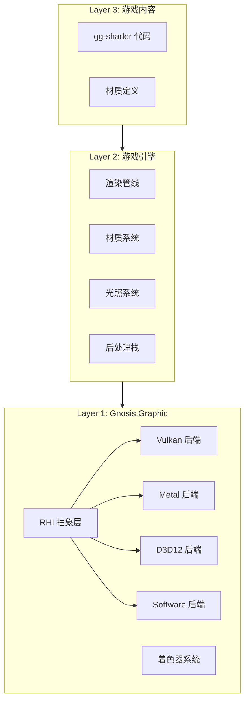
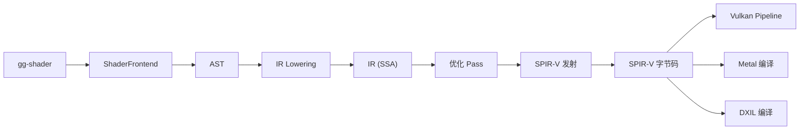

# 渲染系统

Gnosis 渲染系统位于 `Gnosis.Graphic` 包中，采用 RHI 抽象层设计，实现渲染后端的可替换性。

---

## 架构概览



---

## Gnosis.Graphic 子模块

| 子模块 | 职责 | 设计理由 |
|:---|:---|:---|
| `RHI` | Vulkan / DX12 / Metal 抽象层、资源绑定、命令缓冲 | 跨平台渲染的硬件抽象 |
| `Shader` | gg-shader 编译器、着色器反射、运行时绑定 | 统一着色器语言的编译与运行时 |
| `Pipeline` | 前向/延迟/集群渲染管线、渲染图构建 | 可配置的渲染流程 |
| `Material` | 材质系统、材质实例、参数块 | 着色器参数的可视化封装 |
| `Light` | 直接光、阴影、全局光照、光照探针 | 光照系统的完整实现 |
| `Shadow` | 阴影贴图、级联阴影、软阴影 | 光照子系统的核心组件 |
| `PostProcess` | 后处理栈、体积效果、颜色分级 | 画面风格化处理 |
| `Compute` | 计算着色器调度、异构计算抽象 | GPU 通用计算能力 |
| `Terrain` | 高度场地形、LOD、材质混合 | 大地形渲染 |
| `Foliage` | 植被实例化、风场模拟 | 大量小型物体的高效渲染 |
| `FX` | 粒子、拖尾、贴花、体积特效 | 视觉特效的统一子包 |
| `Character` | 皮肤着色器（SSS）、头发渲染、眼睛着色 | 角色特化的渲染技术 |
| `Sky` | 天空盒、大气散射、体积云 | 环境渲染 |
| `Occlusion` | 遮挡剔除、入口剔除、距离剔除 | 渲染性能优化 |
| `Capture` | 反射捕获、光照探针烘焙 | 静态全局光照的基础设施 |

---

## RHI 抽象层

### 设计原则

RHI 层遵循以下原则：

1. **不透明句柄**：所有 GPU 资源通过不透明句柄访问，不暴露底层 API 对象
2. **命令表模式**：绘制调用序列化为命令表，可跨帧复用
3. **后端无关**：上层代码不包含任何 API 特定逻辑

### 核心接口

| 接口 | 职责 |
|------|------|
| `IRHIDevice` | 资源创建、命令提交 |
| `IRHICommandBuffer` | 绘制命令录制 |
| `IRHIShaderModule` | 着色器字节码容器 |
| `IRHIPipelineState` | 管线状态对象 |
| `IRHIBuffer` | 缓冲资源 |
| `IRHITexture` | 纹理资源 |
| `IRHIFramebuffer` | 帧缓冲 |

### 后端实现

| 后端 | 状态 | 平台 |
|------|------|------|
| Vulkan | 已实现 | Windows / Linux / Android |
| Metal | 已实现 | macOS / iOS |
| Direct3D 12 | 已实现 | Windows / Xbox |
| Software | 已实现 | 调试与测试 |

---

## 着色器系统

gg-shader 着色器语言通过 `Gnosis.Toolchain.ShaderCompiler` 编译为 SPIR-V，再由各后端转换为本地着色器。

### 编译流程



### 着色器反射

编译后的着色器包含反射信息：

| 信息 | 描述 |
|------|------|
| 输入/输出语义 | 顶点属性与片段输出 |
| Uniform 绑定 | 常量缓冲与纹理槽位 |
| Push Constant | 推送常量布局 |
| 特殊常量 | 变体选择器 |

---

## 渲染管线

### 管线类型

| 管线 | 描述 | 适用场景 |
|------|------|----------|
| 前向渲染 | 逐对象光照计算 | 少光源、透明物体 |
| 延迟渲染 | G-Buffer + 光照 Pass | 多光源、复杂场景 |
| 集群渲染 | 分簇光照剔除 | 大量光源 |

### 渲染图

渲染管线通过渲染图（Render Graph）构建：

1. 声明渲染 Pass 及其资源依赖
2. 自动进行资源屏障与过渡
3. 自动管理临时资源生命周期

---

## 材质系统

### 材质层次

```
材质定义 (gg-shader)
    ↓
材质模板 (MaterialTemplate)
    ↓
材质实例 (MaterialInstance) ← 参数覆盖
```

### 参数块

材质参数通过参数块（Parameter Block）管理：

| 参数类型 | 描述 |
|----------|------|
| 标量 | float, int, bool |
| 向量 | vec2, vec3, vec4 |
| 矩阵 | mat3, mat4 |
| 纹理 | Texture2D, TextureCube |
| 缓冲 | StructuredBuffer |

---

## 光照系统

### 直接光

| 类型 | 描述 |
|------|------|
| 平行光 | 太阳光，支持级联阴影 |
| 点光源 | 衰减光源 |
| 聚光灯 | 锥形光源 |
| 面光源 | 矩形/圆盘光源 |

### 全局光照

| 技术 | 描述 | 状态 |
|------|------|------|
| 光照探针 | 低频间接光 | 已实现 |
| 环境光遮蔽 | SSAO / HBAO | 已实现 |
| DDGI | 动态漫射全局光 | 规划中 |
| 路径追踪 | 离线/实时混合 | 规划中 |

---

## 后处理栈

### 内置效果

| 效果 | 描述 |
|------|------|
| Bloom | 泛光 |
| Tonemapping | 色调映射 (ACES / Reinhard / AgX) |
| SSAO | 屏幕空间环境光遮蔽 |
| SSR | 屏幕空间反射 |
| DOF | 景深 |
| Motion Blur | 运动模糊 |
| Color Grading | 颜色分级 |
| Vignette | 暗角 |

---

## 虚拟几何

虚拟几何系统位于 `Gnosis.Geometry` 包中，支持 Nanite 风格的网格着色器管线。

| 子模块 | 职责 |
|:---|:---|
| `Cluster` | Meshlet 生成、集群分组、LOD 选择 |
| `Culling` | GPU 驱动剔除、视锥/遮挡/背面剔除 |
| `Stream` | 几何数据流式加载、页面管理 |
| `Raster` | 软件光栅化回退、小三角形光栅化 |
| `Compress` | 几何数据压缩、顶点量化 |
| `Builder` | 源网格预处理、Meshlet 生成工具 |

---

## 性能优化

### 渲染图优化

- 自动合并兼容的渲染 Pass
- 自动插入资源屏障
- 临时资源复用

### 剔除优化

| 技术 | 阶段 | 描述 |
|------|------|------|
| 视锥剔除 | CPU | 粗粒度剔除 |
| 遮挡剔除 | CPU/GPU | 层级遮挡剔除 |
| 距离剔除 | CPU | 远距离物体剔除 |
| 实例化剔除 | GPU | Meshlet 级别剔除 |

### 批处理

- 相同材质的绘制调用自动合并
- 实例化渲染支持
- 间接绘制（Indirect Draw）
