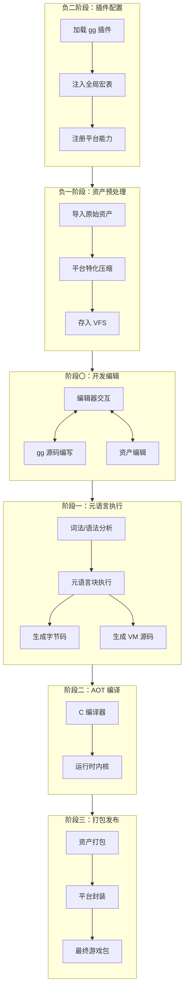
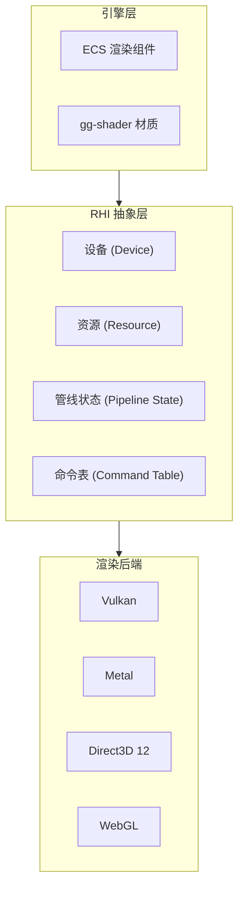
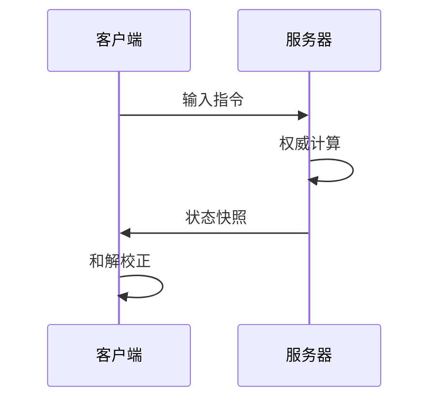
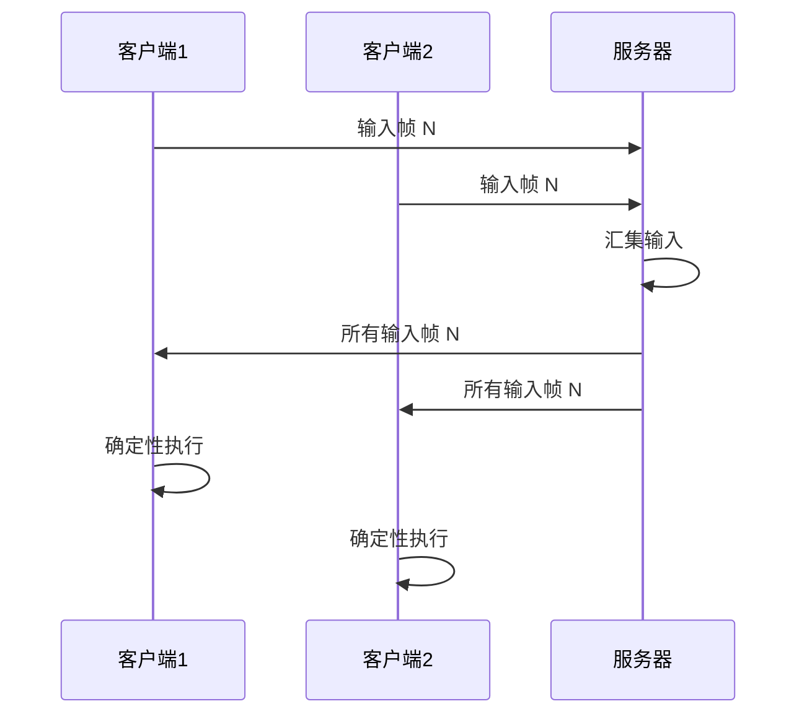
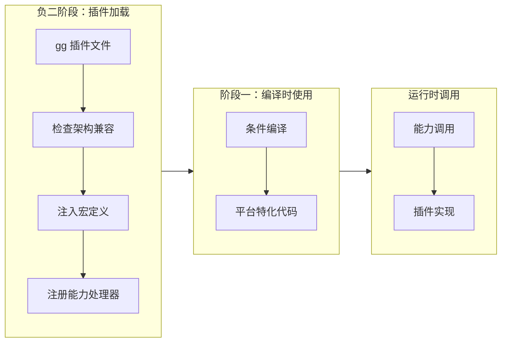

# 设计哲学

Gnosis 引擎的设计围绕五大核心原则展开，这些原则决定了引擎的每一个技术决策。

---

## 一、多阶段编程 (Multi-Stage Programming)

### 核心思想

将构建过程划分为多个阶段，每一阶段的决策固化为下一阶段的常量，最终输出一个**零反射、零冗余**的运行时。

> **语言分层原则**：多阶段编程的实现依赖于两类语言的严格区分——C# 作为**引擎元语言**实现编译器、虚拟机生成器等构建时工具链；GGScript/GGShader/GGWidget 等 GG 语言族作为**游戏对象语言**编写游戏逻辑、着色器和编辑器 UI。游戏开发者使用 GG 语言族编写一切（游戏、插件、Mod、DLC、编辑器 Widget），而非 C#。详见 [项目介绍 - 引擎元语言与游戏对象语言](introduction.md#关键概念引擎元语言与游戏对象语言)。

### 阶段划分



### 各阶段职责

| 阶段 | 执行者 | 输入 | 输出 |
|------|--------|------|------|
| **负二阶段** | C# 元语言 | gg 插件 | 全局宏表、能力注册表 |
| **负一阶段** | C# 资产管线 | 原始资产 | 平台特化资产 |
| **阶段〇** | 编辑器 (gg) | gg 源码、资产 | 编辑后的项目 |
| **阶段一** | C# 编译器 | gg 源码 | 字节码 + VM 源码 |
| **阶段二** | C 编译器 | VM 源码 | AOT 内核 |
| **阶段三** | 打包器 | 字节码 + 资产 + 内核 | 最终游戏包 |

### 编译时 vs 运行时

```tsx
# 编译时宏展开
<% foreach (var (pos, vel) in query) { %>
    pos.x += vel.vx * delta;
    pos.y += vel.vy * delta;
<% } %>

# 生成的字节码 (伪汇编)
GET_ARCHETYPE R0, Archetype_PosVel
LOOP_START:
LD_FIELD R1, R0, offsetof(Position.x)
LD_FIELD R2, R0, offsetof(Velocity.vx)
MUL_F R3, R2, delta
ADD_F R1, R1, R3
ST_FIELD R0, offsetof(Position.x), R1
```

**关键优势**：
- 无运行时类型查询
- 无虚函数调用
- 无动态内存分配（ECS 部分）
- 缓存友好的线性遍历

---

## 二、渲染不可知论

### 核心思想

引擎内核不绑定任何特定图形 API，通过 **RHI (Render Hardware Interface)** 抽象层实现渲染后端的可替换性。

### RHI 抽象层



### RHI 句柄类型

| 句柄类型 | 描述 | 特点 |
|----------|------|------|
| **Device** | 资源创建与命令提交 | 不透明句柄，不暴露 API 对象 |
| **Resource** | 缓冲、纹理、着色器模块 | 引擎原生句柄，跨 API 兼容 |
| **Pipeline State** | 混合模式、顶点布局 | 不包含着色器逻辑 |
| **Command Table** | 序列化的绘制调用 | 可跨帧复用 |

### gg-shader 着色器语言

gg 引擎采用自主设计的 `gg-shader` 语言：

```rust
# gg-shader 示例
fn vs_main(
    position: vec3<f32>,
    uv: vec2<f32>
) -> VertexOutput {
    var output: VertexOutput;
    output.position = uniforms.mvp * vec4<f32>(position, 1.0);
    output.uv = uv;
    return output;
}

fn ps_main(uv: vec2<f32>) -> vec4<f32> {
    return texture.Sample(uv) * uniforms.color;
}
```

**语言特性**：
- 类型后置语法
- 元编程集成：`<% %>` 块支持静态变体生成
- 模块系统：`import` / `export` 实现复用
- 直接生成 SPIR-V 字节码

### 未来扩展

| 后端类型 | 描述 | 状态 |
|----------|------|------|
| **传统光栅化** | Vulkan / Metal / D3D12 | 当前实现 |
| **神经渲染** | NeRF / 3DGS 模型 | 规划中 |
| **扩散模型** | Tensor Core 推理生成 | 规划中 |
| **混合渲染** | 多后端调度合成 | 规划中 |

---

## 三、服务器权威

### 核心思想

联网游戏的逻辑边界严格控制在服务端，客户端仅作表现与预测。服务器是**唯一真相源**。

### 状态同步架构



### 客户端预测与和解

```tsx
system ClientPredictionMovement {
    on_client_update(delta: float) {
        // 立即应用本地输入
        trans.x += input.move_x * speed * delta;
    }
    
    on_receive_server_state(msg: ServerStateMessage) {
        // 计算误差
        var error_x = abs(trans.x - msg.x);
        
        // 超过阈值则回滚
        if (error_x > 0.1) {
            trans.x = msg.x;
        }
    }
}
```

### 帧同步架构



### 模式对比

| 特性 | 状态同步 | 帧同步 |
|------|----------|--------|
| **权威方** | 服务器 | 输入汇集后本地执行 |
| **带宽需求** | 较高（状态快照） | 较低（仅输入） |
| **延迟容忍** | 较高 | 较低 |
| **反作弊** | 天然服务器校验 | 需要同步哈希校验 |
| **适用场景** | RPG、FPS | RTS、格斗 |

---

## 四、软失败与可观测性

### 核心思想

防御与异常处理采用**静默降级、延迟惩罚**策略，避免影响合法玩家体验。

### 反作弊响应策略

```json
{
    "anti_cheat_response": {
        "on_honeypot_trigger": "soft_penalty",
        "on_speed_hack": "correct_value",
        "on_server_validation_fail": "kick",
        "on_repeat_offense": "shadow_ban"
    }
}
```

### 防御等级

| 等级 | 适用对象 | 核心目标 |
|------|----------|----------|
| **基础级** | 独立开发者 / 小型团队 | 阻挡修改器与盗版传播 |
| **增强级** | 中型团队 / 有经济系统的单机 | 增加逆向成本，延迟破解窗口 |
| **专业级** | 大型单机 / 中度联网游戏 | 服务器权威校验 + 行为分析 |
| **企业级** | 头部网游 / 电竞级项目 | 机器学习反作弊 + 法律溯源 |

### 内置防御能力

| 能力名称 | 启用方式 | 功能描述 |
|----------|----------|----------|
| `integrity_check` | `anti_cheat: basic` | 对 `[Sensitive]` 函数进行 CRC 校验 |
| `memory_obfuscate` | `memory_protect: basic` | 对 `[Encrypted]` 字段自动异或加密 |
| `archive_bind` | `save_protect: basic` | 存档 AES-GCM 加密并绑定硬件指纹 |
| `honeypot_field` | `[Honeypot]` 装饰器 | 生成蜜罐变量，被修改时触发软惩罚 |
| `server_authority` | `[ServerOnly]` | 强制逻辑在服务器执行 |
| `rate_limit` | `[RateLimit]` | 限制函数调用频率，防脚本刷量 |

### 核心原则

1. **服务器是唯一真相源**
2. **检测到异常时延迟响应、静默记录**，避免攻击者定位触发点
3. **所有校验不得造成可感知的性能下降**

---

## 五、可插拔架构

### 核心思想

从网络后端、渲染后端到平台插件，均支持编译时或运行时动态替换。

### 插件系统



### 插件示例

```tsx
plugin WeChatChannel {
    requires_arch = ["WASM"];
    provides_macros = ["WECHAT", "WECHAT_SHARE"];
    provides_capabilities = ["WeChatLogin", "WeChatShare"];

    export function login(): Promise<UserInfo> {
        return new Promise((resolve, reject) => {
            wx_login({
                success: (res) => resolve({ code: res.code })
            });
        });
    }
}
```

### 网络后端切换

```tsx
<% if (MACRO.NET_BACKEND == "STEAM") { %>
    import SteamMock;
    type NetBackend = SteamBackend;
<% } else if (MACRO.NET_BACKEND == "WEBSOCKET") { %>
    import WebSocketMock;
    type NetBackend = WebSocketBackend;
<% } %>
```

### 可插拔组件

| 组件类型 | 插拔时机 | 示例 |
|----------|----------|------|
| **平台插件** | 负二阶段 | Steam、微信、PSN |
| **渲染后端** | 阶段二 | Vulkan、Metal、D3D12 |
| **网络后端** | 阶段一 | Steam P2P、WebSocket |
| **资产导入器** | 负一阶段 | 自定义格式支持 |

---

## 设计原则总结

| 原则 | 核心价值 | 技术实现 |
|------|----------|----------|
| **多阶段编程** | 零反射、零冗余 | 编译时宏展开、特化代码生成 |
| **渲染不可知论** | 跨平台渲染 | RHI 抽象层、gg-shader |
| **服务器权威** | 反作弊天然屏障 | 状态同步、客户端预测 |
| **软失败** | 保护合法玩家体验 | 静默降级、延迟惩罚 |
| **可插拔架构** | 灵活扩展 | 插件系统、条件编译 |

---

> 这些原则不是孤立的，而是相互支撑的整体。多阶段编程为渲染不可知论提供了编译时特化的基础；服务器权威与软失败共同构成了完整的反作弊体系；可插拔架构则是所有原则得以实现的保障。
