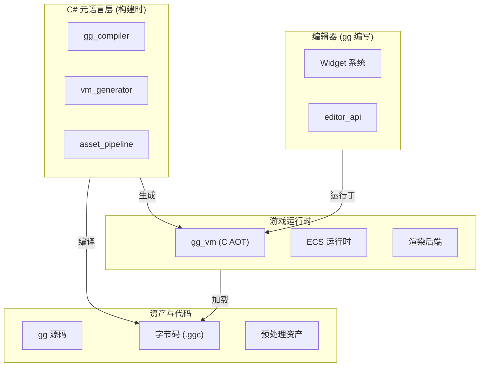

# Gnosis 引擎文档

欢迎来到 **Gnosis 引擎（gg 引擎）** 官方文档。

Gnosis 引擎是一款面向跨平台游戏开发的全栈技术方案，采用**多阶段编程（MSP）**范式，将构建时元编程、运行时虚拟机、ECS 数据架构及可插拔渲染后端深度集成，为开发者提供一套从原型到上线的完整技术方案。

---

## 快速导航

### 入门指南

| 文档 | 描述 |
|------|------|
| [项目介绍](./introduction.md) | 了解 Gnosis 引擎的核心哲学与设计理念 |
| [快速开始](./quick-start.md) | 环境配置、项目构建与第一个 gg 项目 |
| [设计哲学](./design-philosophy.md) | 多阶段编程、渲染不可知论等核心设计原则 |

### 开发指南

| 文档 | 描述 |
|------|------|
| [开发入门](../development/getting-started.md) | 开发环境配置与工作流程 |
| [架构设计](../development/architecture.md) | 引擎整体架构详解 |
| [gg 语言](../development/gg-language.md) | gg 语言语法与 ECS 编程范式 |
| [gg-shader](../development/gg-shader.md) | 着色器语言与渲染管线 |
| [网络架构](../development/network.md) | 帧同步与状态同步的融合 |
| [渲染系统](../development/rendering.md) | RHI 抽象层与渲染后端 |
| [反作弊系统](../development/anti-cheat.md) | 分层防御与安全加固 |

### 维护指南

| 文档 | 描述 |
|------|------|
| [编码规范](../maintenance/coding-standards.md) | Rust/C# 代码风格指南 |
| [测试指南](../maintenance/testing-guide.md) | 单元测试与集成测试 |
| [贡献指南](../maintenance/contributing.md) | 如何参与项目开发 |

---

## 核心特性

### 多阶段编程 (MSP)

将构建过程划分为"负二阶段"至"阶段三"，每一步决策固化为下一阶段的常量，消除运行时反射与冗余。

### 渲染不可知论

引擎内核不绑定任何特定图形 API，通过 RHI 抽象层与 `gg-shader` 着色器语言实现渲染后端的可替换性。

### 服务器权威

联网游戏的逻辑边界严格控制在服务端，客户端仅作表现与预测。

### 软失败与可观测性

防御与异常处理采用静默降级、延迟惩罚策略，避免影响合法玩家体验。

### 可插拔架构

从网络后端、渲染后端到平台插件，均支持编译时或运行时动态替换。

---

## 架构概览



---

## 五大设计原则

| 原则 | 描述 |
|------|------|
| **多阶段编程** | 编译时固化决策，零反射运行时 |
| **渲染不可知论** | RHI 抽象，后端可替换 |
| **服务器权威** | 服务端为唯一真相源 |
| **软失败** | 静默降级，保护玩家体验 |
| **可插拔架构** | 编译时/运行时动态替换 |

---

## 与传统引擎对比

| 特性 | 传统引擎 | Gnosis 引擎 |
|------|----------|-------------|
| 运行时类型信息 | 反射查询 | 编译时固化 |
| 跨平台策略 | 条件编译 | 多阶段特化 |
| 热更新 | 脚本层 | 字节码原生 |
| 编辑器 | 独立实现 | gg 语言编写 |
| 渲染后端 | 绑定 API | RHI 抽象 |
| 网络同步 | 单一模式 | 融合架构 |

---

## 版本信息

| 项目 | 信息 |
|------|------|
| 版本 | 2.0 |
| 状态 | 正式版 |
| 更新日期 | 2026 年 4 月 |

---

## 文档结构

```
documentation/zh-hans/
├── overview/               # 概述文档
│   ├── index.md            # 文档首页
│   ├── introduction.md     # 项目介绍
│   ├── quick-start.md      # 快速开始
│   └── design-philosophy.md # 设计哲学
├── development/            # 开发指南
│   ├── getting-started.md  # 开发入门
│   ├── architecture.md     # 架构设计
│   ├── gg-language.md      # gg 语言
│   ├── gg-shader.md        # 着色器语言
│   ├── network.md          # 网络架构
│   ├── rendering.md        # 渲染系统
│   └── anti-cheat.md       # 反作弊系统
└── maintenance/            # 维护指南
    ├── coding-standards.md # 编码规范
    ├── testing-guide.md    # 测试指南
    └── contributing.md     # 贡献指南
```

---

> Gnosis 引擎，献给所有追求极致性能与开发效率的游戏创造者。
