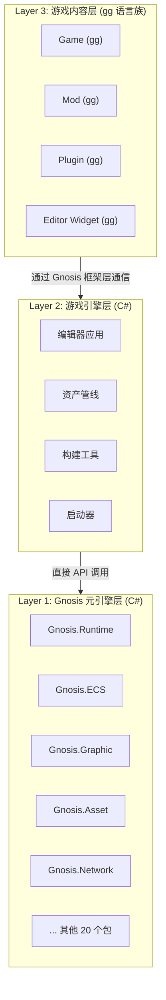

# 项目介绍

## 什么是 Gnosis 引擎

Gnosis 引擎（以下简称 **gg 引擎**）是一款面向**跨平台游戏开发**的元引擎框架，旨在为独立开发者至大型团队提供一致的、高性能的、天然支持热更新的运行时环境。

Gnosis 本身不是游戏引擎，而是用来构建游戏引擎的 25 个 C# 包。游戏引擎由 Gnosis 包组合实例化而成，游戏逻辑则由 gg 语言族编写。这种分层设计使得 Gnosis 可以服务于不同类型的游戏项目，而不仅限于某一种游戏范式。

---

## ⚠️ 关键概念：三层蛋糕模型

在深入了解 Gnosis 引擎之前，**必须首先理解三层蛋糕模型**。这是整个项目架构的基石，混淆这三层将导致设计决策的全面偏差。详见 [架构详解 - 三层蛋糕模型](../maintenance/architecture.md#一三层蛋糕模型必须牢记)。

### 三层定义

| 层次 | 名称 | 编写语言 | 职责 | 运行时形态 |
|:---|:---|:---|:---|:---|
| **Layer 1** | Gnosis 元引擎层 | C#（零外部依赖） | 25 个包构成的基础设施 | 不可独立运行，由 Layer 2 实例化 |
| **Layer 2** | 游戏引擎层 | C#（调用 Gnosis 包） | 编辑器、资产管线、构建工具、启动器 | 可独立运行的 C# 应用程序 |
| **Layer 3** | 游戏内容层 | gg 语言族 | 游戏本体、Mod、DLC、插件、编辑器 Widget | gg 字节码，由 Gnosis.Runtime 解释执行 |

### 两类语言的严格区分

| 概念 | 语言 | 用途 | 开发者 |
|------|------|------|--------|
| **引擎元语言** | C# | 实现引擎基础设施：编译器、虚拟机、RHI、ECS 运行时、资产管线 | 引擎开发者 |
| **游戏对象语言** | GGScript (gg-script) | 游戏逻辑编程：组件、系统、插件、场景 | 游戏开发者 |
| **游戏对象语言** | GGShader (gg-shader) | 着色器编程：顶点/片段/计算/光追着色器 | 游戏开发者 |
| **游戏对象语言** | GGWidget (gg-widget) | 编辑器 UI 编程：声明式 Widget 树 | 游戏开发者 |
| **游戏对象语言** | GGNeural (gg-neural) | 神经网络推理：Tensor Core 加速层 | 游戏开发者 |
| **游戏对象语言** | GGObject (gon) | 对象配置：JSON 超集数据格式 | 游戏开发者 |

### 核心区分原则

1. **游戏开发者使用 GG 语言族编写一切**：无论是游戏本体、插件 (Plugin)、Mod、DLC，还是编辑器 Widget，都使用 GGScript、GGShader、GGWidget 编写，**而非 C#**。
2. **C# 仅用于 Layer 1 和 Layer 2**：编译器、虚拟机、资产管线、RHI 抽象层等引擎基础设施由 C# 实现，游戏开发者不需要也不应该直接使用 C#。
3. **特性标注 (Attribute) 是 GG 语言的语法**：GGScript/GGShader 中的 `[Encrypted]`、`[Vertex]`、`[Compute]` 等是 GG 语言的特性标注，**与 C# 的 `System.Attribute` 完全无关**。
4. **元编程 `<% %>` 是桥梁**：`<% %>` 块内部是 C# 语法，由 C# 元语言层在编译时执行，这是引擎元语言与游戏对象语言之间唯一的交互点。

### 致命错误示例

- ❌ 在 `Gnosis.Core` 中写游戏逻辑 → **游戏逻辑属于 Layer 3，用 gg-script 写**
- ❌ 在 `gg-script` 中实现渲染管线 → **渲染管线属于 Layer 1/2，用 C# 写**
- ❌ 认为 Gnosis 包可以直接 Build 出一个游戏 → **必须先构建一个游戏引擎（Layer 2），再用游戏引擎构建游戏项目（Layer 3）**

---

## 核心哲学：多阶段编程

### 传统引擎的困境

传统游戏引擎在跨平台开发中面临诸多挑战：

| 问题 | 描述 |
|------|------|
| **反射开销** | 运行时类型信息查询带来性能损耗 |
| **平台差异** | 不同平台需要不同的代码路径 |
| **热更新限制** | iOS / 主机平台禁止 JIT，热更新困难 |
| **工具链割裂** | 编辑器、编译器、运行时各自独立 |

### 多阶段编程的解决方案

gg 引擎采用**多阶段编程（Multi-Stage Programming, MSP）**范式，将构建过程划分为多个阶段：

> 各阶段的详细划分、职责与数据流请参阅 [架构设计 - 多阶段编程模型](../development/architecture.md#多阶段编程模型)。

**核心优势**：构建时的每一次决策都固化为后一阶段的常量，最终输出一个**零反射、零 JIT、天然支持热更新**的跨平台游戏运行时。

---

## 与传统引擎对比

| 特性 | 传统引擎 | Gnosis 引擎 |
|------|----------|-------------|
| **运行时类型信息** | 反射查询，性能损耗 | 编译时固化，零反射 |
| **跨平台策略** | 条件编译 + 运行时分支 | 多阶段特化，无运行时开销 |
| **热更新** | Lua/JS 脚本层，性能受限 | 字节码替换，原生性能 |
| **编辑器** | C++/C# 编写，与运行时分离 | gg 语言编写，运行于同一虚拟机 |
| **渲染后端** | 绑定特定 API | RHI 抽象，可插拔后端 |
| **网络同步** | 单一模式 | 帧同步与状态同步融合 |
| **引擎形态** | 单体引擎 | 元引擎 + 游戏引擎分层 |

---

## 五大核心特性

### 1. 多阶段编程 (MSP)

将构建过程划分为"负二阶段"至"阶段三"，每一步决策固化为下一阶段的常量，消除运行时反射与冗余。

### 2. 渲染不可知论

引擎内核不绑定任何特定图形 API，通过 RHI 抽象层与 `gg-shader` 着色器语言实现渲染后端的可替换性。

### 3. 服务器为唯一真相源

联网游戏的逻辑边界严格控制在服务端，客户端仅作表现与预测。

### 4. 软失败与可观测性

防御与异常处理采用静默降级、延迟惩罚策略，避免影响合法玩家体验。

### 5. 可插拔架构

从网络后端、渲染后端到平台插件，均支持编译时或运行时动态替换。

---

## 总体架构

---

## 开发者角色的转变

在 gg 引擎范式下，游戏开发者获得前所未有的能力：

| 传统模式 | Gnosis 模式 |
|----------|-------------|
| 为每个平台维护独立代码分支 | 一次编写，多阶段特化 |
| 热更新需要额外脚本层 | 字节码原生支持热更新 |
| 编辑器与游戏运行时割裂 | 统一的 gg 语言生态 |
| 渲染后端绑定特定 API | RHI 抽象，后端可替换 |
| 网络同步模式固定 | 帧同步与状态同步无缝切换 |

---

## 版本信息

| 项目 | 信息 |
|------|------|
| 版本 | 2.0 |
| 状态 | 正式版 |
| 更新日期 | 2026 年 4 月 |

---

> Gnosis 引擎，献给所有追求极致性能与开发效率的游戏创造者。
