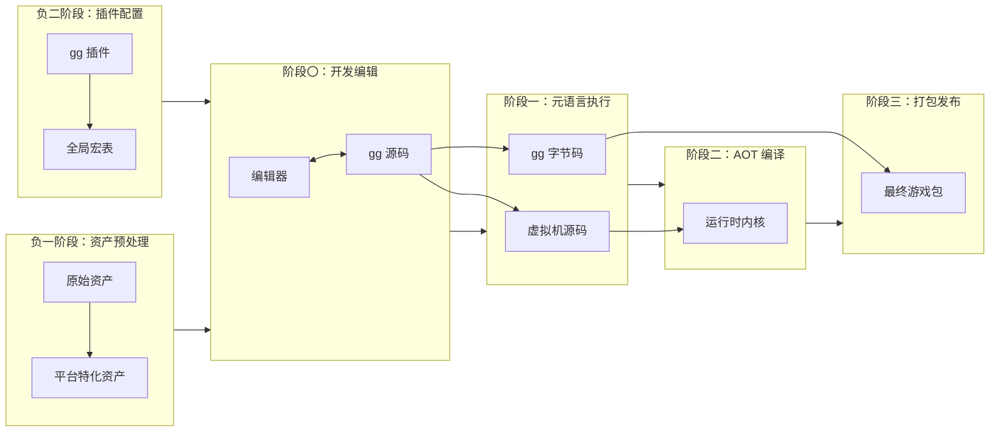
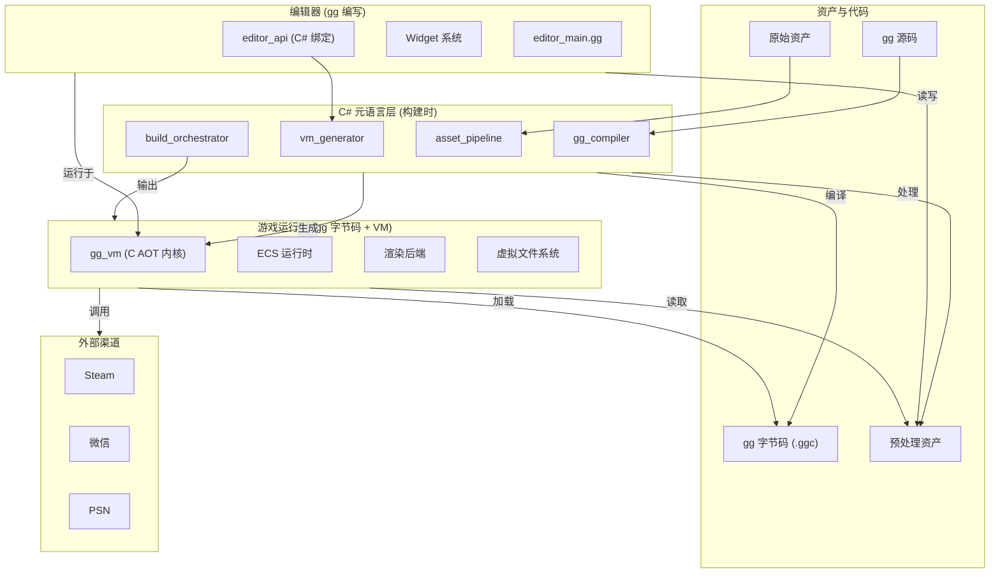

# 项目介绍

## 什么是 Gnosis 引擎

Gnosis 引擎（以下简称 **gg 引擎**）是一款面向**跨平台游戏开发**的全栈技术方案，旨在为独立开发者至大型团队提供一致的、高性能的、天然支持热更新的运行时环境。

其核心思想是将游戏逻辑与底层基础设施彻底解耦，通过自定义字节码与特化虚拟机，实现"一次编写，多端原生运行"。

---

## 核心哲学：多阶段编程

### 传统引擎的困境

传统游戏引擎在跨平台开发中面临诸多挑战：

| 问题 | 描述 |
|------|------|
| **反射开销** | 运行时类型信息查询带来性能损耗 |
| **平台差异** | 不同平台需要不同的代码路径 |
| **热更新限制** | iOS / 主机平台禁止 JIT，热更新困难 |
| **工具链割裂** | 编辑器、编译器、运行时各自独立 |

### 多阶段编程的解决方案

gg 引擎采用**多阶段编程（Multi-Stage Programming, MSP）**范式，将构建过程划分为多个阶段：

**核心优势**：构建时的每一次决策都固化为后一阶段的常量，最终输出一个**零反射、零 JIT、天然支持热更新**的跨平台游戏运行时。

---

## 与传统引擎对比

| 特性 | 传统引擎 | Gnosis 引擎 |
|------|----------|-------------|
| **运行时类型信息** | 反射查询，性能损耗 | 编译时固化，零反射 |
| **跨平台策略** | 条件编译 + 运行时分支 | 多阶段特化，无运行时开销 |
| **热更新** | Lua/JS 脚本层，性能受限 | 字节码替换，原生性能 |
| **编辑器** | C++/C# 编写，与运行时分离 | gg 语言编写，运行于同一虚拟机 |
| **渲染后端** | 绑定特定 API | RHI 抽象，可插拔后端 |
| **网络同步** | 单一模式 | 帧同步与状态同步融合 |

---

## 五大核心特性

### 1. 多阶段编程 (MSP)

将构建过程划分为"负二阶段"至"阶段三"，每一步决策固化为下一阶段的常量，消除运行时反射与冗余。

### 2. 渲染不可知论

引擎内核不绑定任何特定图形 API，通过 RHI 抽象层与 `gg-shader` 着色器语言实现渲染后端的可替换性。

### 3. 服务器为唯一真相源

联网游戏的逻辑边界严格控制在服务端，客户端仅作表现与预测。

### 4. 软失败与可观测性

防御与异常处理采用静默降级、延迟惩罚策略，避免影响合法玩家体验。

### 5. 可插拔架构

从网络后端、渲染后端到平台插件，均支持编译时或运行时动态替换。

---

## 总体架构

---

## 开发者角色的转变

在 gg 引擎范式下，游戏开发者获得前所未有的能力：

| 传统模式 | Gnosis 模式 |
|----------|-------------|
| 为每个平台维护独立代码分支 | 一次编写，多阶段特化 |
| 热更新需要额外脚本层 | 字节码原生支持热更新 |
| 编辑器与游戏运行时割裂 | 统一的 gg 语言生态 |
| 渲染后端绑定特定 API | RHI 抽象，后端可替换 |
| 网络同步模式固定 | 帧同步与状态同步无缝切换 |

---

## 版本信息

| 项目 | 信息 |
|------|------|
| 版本 | 2.0 |
| 状态 | 正式版 |
| 更新日期 | 2026 年 4 月 |

---

> Gnosis 引擎，献给所有追求极致性能与开发效率的游戏创造者。
